    library(tidyverse)

{} Run the code below in your console to download this
exercise as a set of R scripts.

    usethis::use_course("CFSS-MACSS/exploratory-data-analysis")

{}

The Department of Education collects [annual statistics on colleges and
universities in the United States](https://collegescorecard.ed.gov/). A
subset of this data from 2018-19 is included in the
[`rcis`](https://github.com/CFSS-MACSS/rcis) library from GitHub.

{} If you are working on your local R you need to
install the package first by running the command
`remotes::install_github("CFSS-MACSS/rcis")` in the console. If you
don’t already have the `remotes` library installed, you will get an
error. Go back and install this first using
`install.packages("remotes")`, then run
`remotes::install_github("CFSS-MACSS/rcis")`. {}

    library(rcis)
    data("scorecard")
    glimpse(scorecard)

    ## Rows: 1,721
    ## Columns: 14
    ## $ unitid    <dbl> 100654, 100663, 100706, 100724, 100751, 100830, 100858, 100937, 101189, 101365, 101435, 101453, 101480, 101541, 1…
    ## $ name      <chr> "Alabama A & M University", "University of Alabama at Birmingham", "University of Alabama in Huntsville", "Alabam…
    ## $ state     <chr> "AL", "AL", "AL", "AL", "AL", "AL", "AL", "AL", "AL", "AL", "AL", "AL", "AL", "AL", "AL", "AL", "AL", "AL", "AL",…
    ## $ type      <fct> "Public", "Public", "Public", "Public", "Public", "Public", "Public", "Private, nonprofit", "Private, nonprofit",…
    ## $ admrate   <dbl> 0.8965, 0.8060, 0.7711, 0.9888, 0.8039, 0.9555, 0.8507, 0.6045, 0.7576, 0.9153, 0.5439, 0.6667, 0.6369, 0.5648, 0…
    ## $ satavg    <dbl> 959, 1245, 1300, 938, 1262, 1061, 1302, 1202, 1068, NA, 1101, NA, 1084, 1068, 1035, NA, 1131, NA, NA, 1219, 1162,…
    ## $ cost      <dbl> 23445, 25542, 24861, 21892, 30016, 20225, 32196, 32514, 34835, 30319, 37483, NA, 21560, 32380, 22645, 36890, 2601…
    ## $ netcost   <dbl> 15529, 16530, 17208, 19534, 20917, 13678, 24018, 19808, 20500, 25741, 21632, NA, 17523, 16976, 16747, 23416, 1858…
    ## $ avgfacsal <dbl> 68391, 102420, 87273, 64746, 93141, 69561, 96498, 62649, 53334, 56736, 61974, 53226, 65934, 48888, 58959, 47385, …
    ## $ pctpell   <dbl> 0.7095, 0.3397, 0.2403, 0.7368, 0.1718, 0.4654, 0.1343, 0.2258, 0.5009, 0.6970, 0.4077, 0.4915, 0.4003, 0.5520, 0…
    ## $ comprate  <dbl> 0.2866, 0.6117, 0.5714, 0.3177, 0.7214, 0.3040, 0.7870, 0.7094, 0.2711, 0.2222, 0.4185, 0.1429, 0.4551, 0.4756, 0…
    ## $ firstgen  <dbl> 0.3658281, 0.3412237, 0.3101322, 0.3434343, 0.2257127, 0.3818961, 0.1726471, 0.1724942, 0.4300319, 0.5209033, 0.3…
    ## $ debt      <dbl> 15250, 15085, 14000, 17500, 17671, 12000, 17500, 16000, 14250, 11855, 17500, NA, 15000, 15750, 12500, 19645, 1581…
    ## $ locale    <fct> City, City, City, City, City, City, City, City, City, Suburb, City, City, Suburb, Rural, Rural, Rural, Suburb, Ci…

`glimpse()` is part of the `tibble` package and is a transposed version
of `print()`: columns run down the page, and data runs across. With a
data frame with multiple columns, sometimes there is not enough
horizontal space on the screen to print each column. By transposing the
data frame, we can see all the columns and the values recorded for the
initial rows.

Type `?scorecard` in the console to open up the help file for this data
set. This includes the documentation for all the variables. Use your
knowledge of `dplyr` and `ggplot2` functions to answer the following
questions.

## Which type of college has the highest average SAT score?

**NOTE: This time, use a graph to visualize your answer, [not a
table](/notes/transform-college/#generate-a-data-frame-with-the-average-sat-score-for-each-type-of-college).**

{{&lt; spoiler text=“Click for the solution” &gt;}}

We could use a **boxplot** to visualize the distribution of SAT scores.

    ggplot(
      data = scorecard,
      mapping = aes(x = type, y = satavg)
    ) +
      geom_boxplot()

    ## Warning: Removed 598 rows containing non-finite values (`stat_boxplot()`).

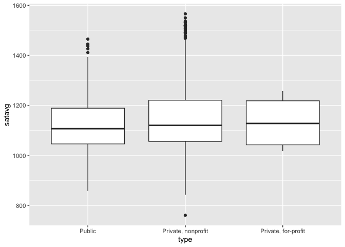

According to this graph, private, nonprofit schools have the highest
average SAT score, followed by public and then private, for-profit
schools. But this doesn’t reveal the entire picture.

What happens if we plot a **histogram** or **frequency polygon**? A
frequency polygon is similar to a histogram but makes it easier to see
the shape of the distribution.

    ggplot(
      data = scorecard,
      mapping = aes(x = satavg)
    ) +
      geom_histogram() +
      facet_wrap(facets = vars(type))

    ## `stat_bin()` using `bins = 30`. Pick better value with `binwidth`.

    ## Warning: Removed 598 rows containing non-finite values (`stat_bin()`).

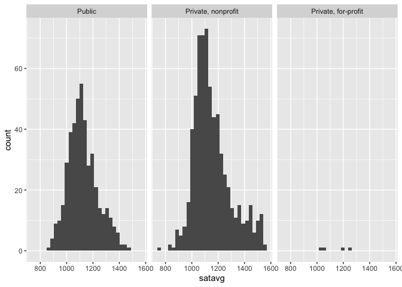

    ggplot(
      data = scorecard,
      mapping = aes(x = satavg, color = type)
    ) +
      geom_freqpoly()

    ## `stat_bin()` using `bins = 30`. Pick better value with `binwidth`.

    ## Warning: Removed 598 rows containing non-finite values (`stat_bin()`).

From these graphs, we can see the averages for each college type are
based on widely varying sample sizes.

Based on these results, we can further inquiry our data to check the
observations that have valid SAT averages scores, thus filtering all the
“NA”:

    # observations with non-NA SAT averages
    scorecard %>%
      drop_na(satavg) %>%
      ggplot(
        mapping = aes(x = type)
      ) +
      geom_bar()

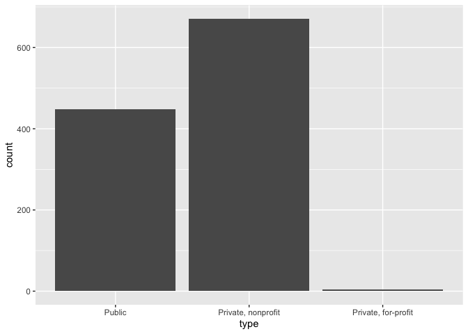

    # what proportion of observations have NA for satavg?
    scorecard %>%
      group_by(type) %>%
      summarize(prop = sum(is.na(satavg)) / n()) %>%
      ggplot(
        mapping = aes(x = type, y = prop)
      ) +
      geom_col()

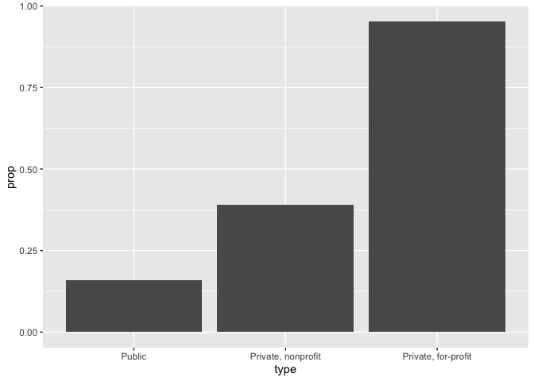

There are far fewer private, for-profit colleges than the other
categories. Furthermore, private, for-profit colleges disproportionately
fail to report average SAT scores compared to the other categories
(likely these schools do not require SAT scores from applicants).

A boxplot alone would not reveal this detail, which could be important
in future analysis.

{{&lt; /spoiler &gt;}}

## What is the relationship between net cost of attendance and faculty salaries? How does this relationship differ across types of colleges?

{{&lt; spoiler text=“Click for the solution” &gt;}}

    # geom_point
    ggplot(
      data = scorecard,
      mapping = aes(x = netcost, y = avgfacsal)
    ) +
      geom_point() +
      geom_smooth()

    ## `geom_smooth()` using method = 'gam' and formula = 'y ~ s(x, bs = "cs")'

    ## Warning: Removed 52 rows containing non-finite values (`stat_smooth()`).

    ## Warning: Removed 52 rows containing missing values (`geom_point()`).

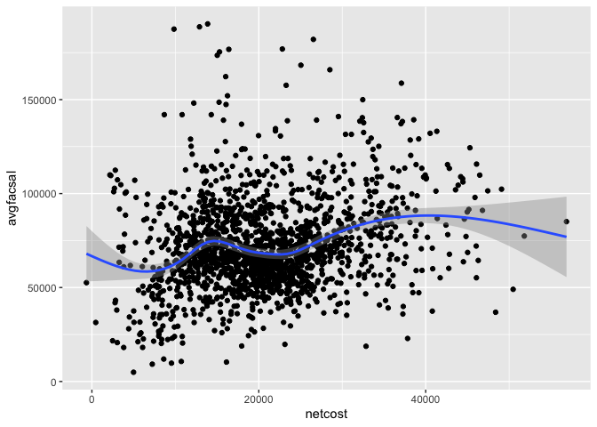

    # geom_point with alpha transparency to reveal dense clusters
    ggplot(
      data = scorecard,
      mapping = aes(x = netcost, y = avgfacsal)
    ) +
      geom_point(alpha = .2) +
      geom_smooth()

    ## `geom_smooth()` using method = 'gam' and formula = 'y ~ s(x, bs = "cs")'

    ## Warning: Removed 52 rows containing non-finite values (`stat_smooth()`).
    ## Removed 52 rows containing missing values (`geom_point()`).

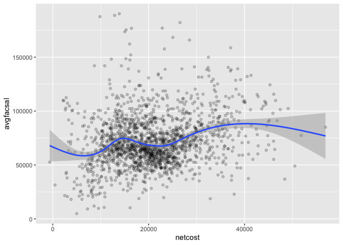

    # geom_hex
    ggplot(
      data = scorecard,
      mapping = aes(x = netcost, y = avgfacsal)
    ) +
      geom_hex() +
      geom_smooth()

    ## Warning: Removed 52 rows containing non-finite values (`stat_binhex()`).

    ## `geom_smooth()` using method = 'gam' and formula = 'y ~ s(x, bs = "cs")'

    ## Warning: Removed 52 rows containing non-finite values (`stat_smooth()`).

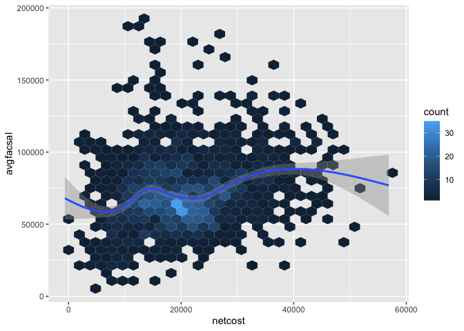

    # geom_point with smoothing lines for each type
    ggplot(
      data = scorecard,
      mapping = aes(
        x = netcost,
        y = avgfacsal,
        color = type
      )
    ) +
      geom_point(alpha = .2) +
      geom_smooth()

    ## `geom_smooth()` using method = 'gam' and formula = 'y ~ s(x, bs = "cs")'

    ## Warning: Removed 52 rows containing non-finite values (`stat_smooth()`).
    ## Removed 52 rows containing missing values (`geom_point()`).

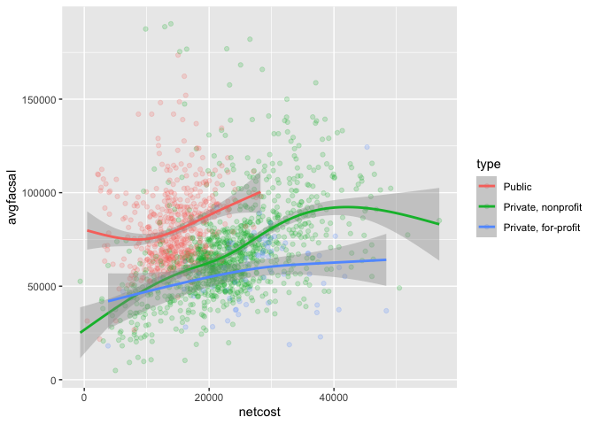

    # geom_point with facets for each type
    ggplot(
      data = scorecard,
      mapping = aes(
        x = netcost,
        y = avgfacsal,
        color = type
      )
    ) +
      geom_point(alpha = .2) +
      geom_smooth() +
      facet_grid(cols = vars(type))

    ## `geom_smooth()` using method = 'gam' and formula = 'y ~ s(x, bs = "cs")'

    ## Warning: Removed 52 rows containing non-finite values (`stat_smooth()`).
    ## Removed 52 rows containing missing values (`geom_point()`).

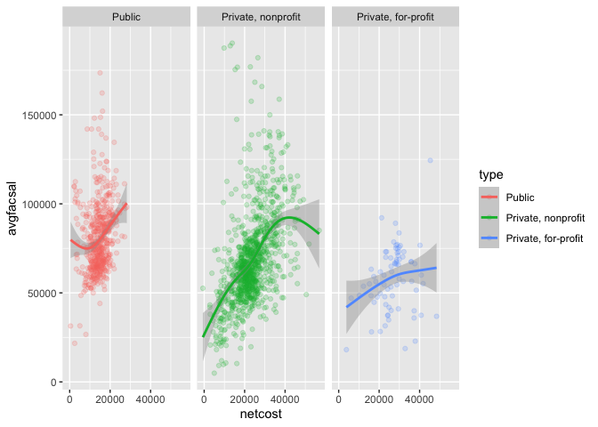

{{&lt; /spoiler &gt;}}

## How are a college’s Pell Grant recipients related to the average student’s education debt?

{{&lt; spoiler text=“Click for the solution” &gt;}}

Since both Pell Grant recipient `pctpell` and average student’s dept
`debt` are continuous variables a **scatterplot** is appropriate:

    ggplot(
      data = scorecard,
      mapping = aes(x = pctpell, y = debt)
    ) +
      geom_point()

    ## Warning: Removed 116 rows containing missing values (`geom_point()`).

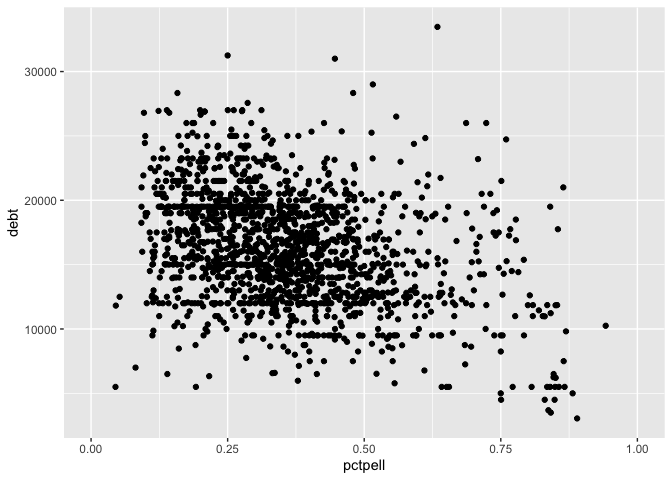

Hmm. There seem to be a lot of data points. It isn’t really clear if
there is a trend. What if we make our data points semi-transparent using
the `alpha` aesthetic?

    ggplot(
      data = scorecard,
      mapping = aes(x = pctpell, y = debt)
    ) +
      geom_point(alpha = .2)

    ## Warning: Removed 116 rows containing missing values (`geom_point()`).

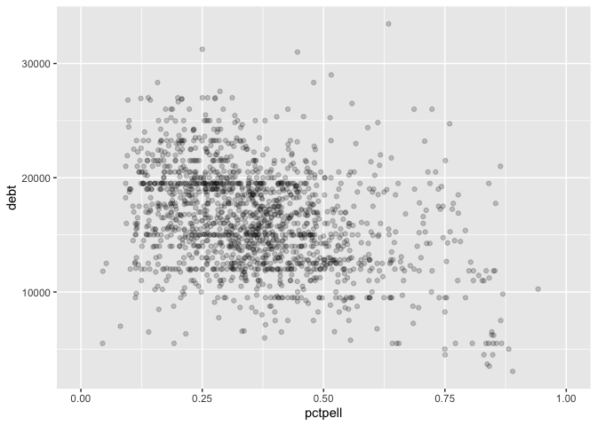

Now we’re getting somewhere. I’m beginning to see some dense clusters in
the middle. Maybe a **hexagon binning** plot would help

    ggplot(
      data = scorecard,
      mapping = aes(x = pctpell, y = debt)
    ) +
      geom_hex()

    ## Warning: Removed 116 rows containing non-finite values (`stat_binhex()`).

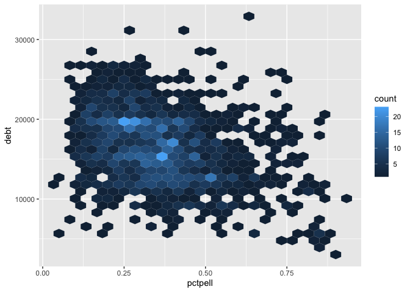

This is getting better. It looks like there might be a downward trend;
that is, as the percentage of Pell grant recipients increases, average
student debt decreases. Let’s confirm this by going back to the
scatterplot and overlaying a **smoothing line**.

    ggplot(
      data = scorecard,
      mapping = aes(x = pctpell, y = debt)
    ) +
      geom_point(alpha = .2) +
      geom_smooth()

    ## `geom_smooth()` using method = 'gam' and formula = 'y ~ s(x, bs = "cs")'

    ## Warning: Removed 116 rows containing non-finite values (`stat_smooth()`).

    ## Warning: Removed 116 rows containing missing values (`geom_point()`).

This confirms our initial evidence - there is an apparent negative
relationship.

Take-home point: Notice how we iterated through several different plots
before we created one that provided the most informative visualization.
**You will not create the perfect graph on your first attempt.** Trial
and error is necessary in this exploratory stage. Be prepared to revise
your code again and again.

{{&lt; /spoiler &gt;}}

## Session Info

    sessioninfo::session_info()

    ## ─ Session info ────────────────────────────────────────────────────────────────────────────────────────────────────────────────────
    ##  setting  value
    ##  version  R version 4.3.0 (2023-04-21)
    ##  os       macOS Monterey 12.6.6
    ##  system   aarch64, darwin20
    ##  ui       RStudio
    ##  language (EN)
    ##  collate  en_US.UTF-8
    ##  ctype    en_US.UTF-8
    ##  tz       America/Chicago
    ##  date     2023-06-20
    ##  rstudio  2023.06.0+421 Mountain Hydrangea (desktop)
    ##  pandoc   3.1.1 @ /Applications/RStudio.app/Contents/Resources/app/quarto/bin/tools/ (via rmarkdown)
    ## 
    ## ─ Packages ────────────────────────────────────────────────────────────────────────────────────────────────────────────────────────
    ##  ! package     * version date (UTC) lib source
    ##  V blogdown      1.17    2023-06-19 [1] CRAN (R 4.3.0) (on disk 1.18)
    ##    bslib         0.5.0   2023-06-09 [1] CRAN (R 4.3.0)
    ##    cachem        1.0.8   2023-05-01 [1] CRAN (R 4.3.0)
    ##    cli           3.6.1   2023-03-23 [1] CRAN (R 4.3.0)
    ##    codetools     0.2-19  2023-02-01 [1] CRAN (R 4.3.0)
    ##    colorspace    2.1-0   2023-01-23 [1] CRAN (R 4.3.0)
    ##    digest        0.6.31  2022-12-11 [1] CRAN (R 4.3.0)
    ##    dplyr       * 1.1.2   2023-04-20 [1] CRAN (R 4.3.0)
    ##    evaluate      0.21    2023-05-05 [1] CRAN (R 4.3.0)
    ##    fansi         1.0.4   2023-01-22 [1] CRAN (R 4.3.0)
    ##    farver        2.1.1   2022-07-06 [1] CRAN (R 4.3.0)
    ##    fastmap       1.1.1   2023-02-24 [1] CRAN (R 4.3.0)
    ##    forcats     * 1.0.0   2023-01-29 [1] CRAN (R 4.3.0)
    ##    generics      0.1.3   2022-07-05 [1] CRAN (R 4.3.0)
    ##    ggplot2     * 3.4.2   2023-04-03 [1] CRAN (R 4.3.0)
    ##    glue          1.6.2   2022-02-24 [1] CRAN (R 4.3.0)
    ##    gtable        0.3.3   2023-03-21 [1] CRAN (R 4.3.0)
    ##    here          1.0.1   2020-12-13 [1] CRAN (R 4.3.0)
    ##    hexbin        1.28.3  2023-03-21 [1] CRAN (R 4.3.0)
    ##    highr         0.10    2022-12-22 [1] CRAN (R 4.3.0)
    ##    hms           1.1.3   2023-03-21 [1] CRAN (R 4.3.0)
    ##    htmltools     0.5.5   2023-03-23 [1] CRAN (R 4.3.0)
    ##    httpuv        1.6.11  2023-05-11 [1] CRAN (R 4.3.0)
    ##    jquerylib     0.1.4   2021-04-26 [1] CRAN (R 4.3.0)
    ##    jsonlite      1.8.5   2023-06-05 [1] CRAN (R 4.3.0)
    ##    knitr         1.43    2023-05-25 [1] CRAN (R 4.3.0)
    ##    labeling      0.4.2   2020-10-20 [1] CRAN (R 4.3.0)
    ##    later         1.3.1   2023-05-02 [1] CRAN (R 4.3.0)
    ##    lattice       0.21-8  2023-04-05 [1] CRAN (R 4.3.0)
    ##    lifecycle     1.0.3   2022-10-07 [1] CRAN (R 4.3.0)
    ##    lubridate   * 1.9.2   2023-02-10 [1] CRAN (R 4.3.0)
    ##    magrittr      2.0.3   2022-03-30 [1] CRAN (R 4.3.0)
    ##    Matrix        1.5-4   2023-04-04 [1] CRAN (R 4.3.0)
    ##    mgcv          1.8-42  2023-03-02 [1] CRAN (R 4.3.0)
    ##    munsell       0.5.0   2018-06-12 [1] CRAN (R 4.3.0)
    ##    nlme          3.1-162 2023-01-31 [1] CRAN (R 4.3.0)
    ##    pillar        1.9.0   2023-03-22 [1] CRAN (R 4.3.0)
    ##    pkgconfig     2.0.3   2019-09-22 [1] CRAN (R 4.3.0)
    ##    processx      3.8.1   2023-04-18 [1] CRAN (R 4.3.0)
    ##    promises      1.2.0.1 2021-02-11 [1] CRAN (R 4.3.0)
    ##    ps            1.7.5   2023-04-18 [1] CRAN (R 4.3.0)
    ##    purrr       * 1.0.1   2023-01-10 [1] CRAN (R 4.3.0)
    ##    R6            2.5.1   2021-08-19 [1] CRAN (R 4.3.0)
    ##    rcis        * 0.2.7   2023-06-19 [1] Github (CFSS-MACSS/rcis@a4b198f)
    ##    Rcpp          1.0.10  2023-01-22 [1] CRAN (R 4.3.0)
    ##    readr       * 2.1.4   2023-02-10 [1] CRAN (R 4.3.0)
    ##    rlang         1.1.1   2023-04-28 [1] CRAN (R 4.3.0)
    ##    rmarkdown     2.22    2023-06-01 [1] CRAN (R 4.3.0)
    ##    rprojroot     2.0.3   2022-04-02 [1] CRAN (R 4.3.0)
    ##    rstudioapi    0.14    2022-08-22 [1] CRAN (R 4.3.0)
    ##    sass          0.4.6   2023-05-03 [1] CRAN (R 4.3.0)
    ##    scales        1.2.1   2022-08-20 [1] CRAN (R 4.3.0)
    ##    servr         0.27    2023-05-02 [1] CRAN (R 4.3.0)
    ##    sessioninfo   1.2.2   2021-12-06 [1] CRAN (R 4.3.0)
    ##    stringi       1.7.12  2023-01-11 [1] CRAN (R 4.3.0)
    ##    stringr     * 1.5.0   2022-12-02 [1] CRAN (R 4.3.0)
    ##    tibble      * 3.2.1   2023-03-20 [1] CRAN (R 4.3.0)
    ##    tidyr       * 1.3.0   2023-01-24 [1] CRAN (R 4.3.0)
    ##    tidyselect    1.2.0   2022-10-10 [1] CRAN (R 4.3.0)
    ##    tidyverse   * 2.0.0   2023-02-22 [1] CRAN (R 4.3.0)
    ##    timechange    0.2.0   2023-01-11 [1] CRAN (R 4.3.0)
    ##    tzdb          0.4.0   2023-05-12 [1] CRAN (R 4.3.0)
    ##    utf8          1.2.3   2023-01-31 [1] CRAN (R 4.3.0)
    ##    vctrs         0.6.2   2023-04-19 [1] CRAN (R 4.3.0)
    ##    withr         2.5.0   2022-03-03 [1] CRAN (R 4.3.0)
    ##    xfun          0.39    2023-04-20 [1] CRAN (R 4.3.0)
    ##    yaml          2.3.7   2023-01-23 [1] CRAN (R 4.3.0)
    ## 
    ##  [1] /Library/Frameworks/R.framework/Versions/4.3-arm64/Resources/library
    ## 
    ##  V ── Loaded and on-disk version mismatch.
    ## 
    ## ───────────────────────────────────────────────────────────────────────────────────────────────────────────────────────────────────

## Acknowledgments

-   This page has been developed starting from Sabrina Nardin and
    Benjamin Soltoff’s “Computing for the Social Sciences” course
    materials, licensed under the CC BY-NC 4.0 Creative Commons License.
