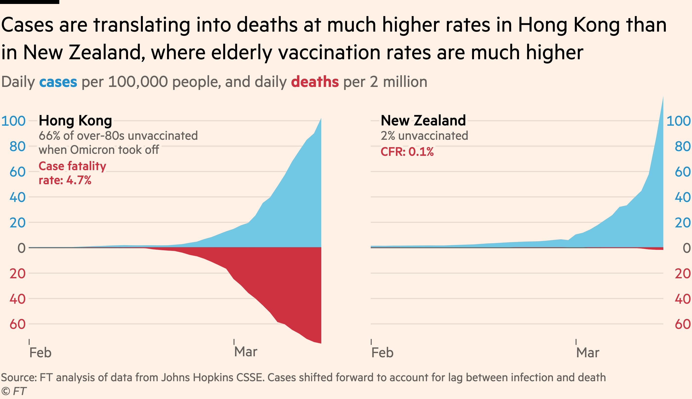

```{r setup, include = FALSE, cache = FALSE}
# generate CSS file
library(xaringanthemer)
style_xaringan(
  text_color = "#464A53",
  header_color = "#586891",
  background_color = "#F1F3F2",
  title_slide_background_color = "#586891",
  title_slide_text_color = "#F1F3F2",
  table_row_even_background_color = "#B3A6A3",
  link_color= "#586891",
  text_bold_color= "#586891",
  #code_highlight_color= rgba(255,255,0,0.5),
  inverse_text_color= "#464A53",
  inverse_background_color= "#B3A6A3",
  inverse_header_color= "#464A53",
  inverse_link_color= "#586891",
  header_background_color= "#586891",
  header_background_text_color= "#F1F3F2",
  code_highlight_color = "#9ab7c4",
  text_font_family = "Nunito",
  text_font_url = "https://fonts.google.com/specimen/Nunito?stroke=Sans+Serif",
  header_font_google = google_font("Afacad"),
  base_font_size= "28px",
  text_font_size= "1rem",
  code_font_size= "20px",
  code_inline_font_size= "1em",
  header_h1_font_size= "2rem",
  header_h2_font_size= "1.75rem",
  header_h3_font_size= "1.5rem")


# source in the default knitr options
source(here::here("R", "slide-opts.R"))
knitr::opts_chunk$set(echo = FALSE)

# enable panelsets and default theme
xaringanExtra::use_panelset()
# ggplot2::theme_set(ggplot2::theme_minimal(base_size = 16))

# load basic packages
library(knitr)
library(here)
library(countdown)
library(patchwork)
library(flipbookr)
library(scales)

mp4_vid <- function(src){
  HTML(
    paste0(
      '<video autoplay>
        <source src="', src, '" type="video/mp4">
      </video>'
    )
  )
}
```

```{r packages, include = FALSE, cache = FALSE}
library(tidyverse)
library(knitr)
library(stringr)
library(broom)
library(datasauRus)
library(gganimate)
library(socviz)
library(patchwork)
#library(rcis)
library(tidycensus)
library(statebins)
library(here)

set.seed(123)
```

class: middle, inverse

# Course Details

---

## Teaching team

### Instructor

* Jean Clipperton - clipperton@uchicago.edu

### Teaching assistant

* Yangyu Wang - wangyd@uchicago.edu

---

## Themes: what, why, and how

- **What:** the plot
  - Specific types of visualizations for a particular purpose (e.g., maps for spatial data, Sankey diagrams for proportions, etc.) 
  - Tooling to produce them (e.g., specific R packages)

--
- **How:** the process
  - Start with a design (sketch + pseudo code)
  - Pre-process data (e.g., wrangle, reshape, join, etc.)
  - Map data to aesthetics
  - Make visual encoding decisions (e.g., address accessibility concerns)
  - Post-process for visual appeal and annotation

--
- **Why:** the theory
  - Tie together "how" and "what" through the grammar of graphics

---

class: middle, inverse

# Course components

---

## Course website

.center[.large[[https://macs40700.netlify.app/](https://macs40700.netlify.app/)]]

.center[
<iframe width="900" height="450" src="https://macs40700.netlify.app/" frameborder="0" style="background:white;"></iframe>  
]

---

## Lectures

- Build on readings
- Attendance *and engagement* expected


- A little bit of everything:
  - Traditional lecture
  - Live coding + demos
  - Short exercises + solution discussion

---

## Announcements

- Posted on Ed, be sure to check regularly 

- I'll assume that you've read an announcement by the next "business" day

.center[
<iframe width="900" height="450" src="https://edstem.org/us/courses/70315/discussion/" frameborder="0" style="background:white;"></iframe>  
]

---

class: middle, inverse

# Assessments

---

## Assessments

- Homework assignments
  - Accessed on GitHub, submitted on Canvas, individual or team
- Final Project
  - Accessed on GitHub, submitted on Canvas, individual or team-based

---

## Teams: UP TO YOU

- Final project
  - You can opt in to group work OR work independently
  - Team-based submissions may be up to three people and each person must clearly explain their contributions to the project both descriptively and within a % (e.g. I did x while my partner did y and I contributed z% to the project (but more detail!)). While the percentages don't have to match exactly, they should be in the general ball-park. 
- Expectations and roles
  - Everyone is expected to contribute equal *effort*
  - Everyone is expected to understand *all* code turned in
  - Individual contribution evaluated by peer evaluation, commits, etc.

---

## Grading

|Assignment|Type       |Value  | n  |Due                  |
|:---------|:----------|:------|:---|---------------------|
|Assignments         |Individual-ish      |60%    | 5* | ~ Every other week  |
|Final choice | Choice      |40%    | 1 .fn[*]  | Exam week      | 


.footnote[[*] check-ins and proposal are part of this grade]
---

class: middle, inverse

# Course policies

---

## Collaboration policy

- Only work that is clearly designated as team work should be completed collaboratively (Projects)

- Homework assignments must be completed individually. You may not directly share answers / code with others, however you are welcome to discuss the problems in general and ask for advice.

---

## Sharing / reusing code policy

- We are aware that a huge volume of code is available on the web, and many tasks may have solutions posted

- Unless explicitly stated otherwise, this course's policy is that you may make use of any online resources (e.g. RStudio Community, StackOverflow, etc.) but you must explicitly cite where you obtained any code you directly use or use as inspiration in your solution(s).

- Any recycled code that is discovered and is not explicitly cited will be treated as plagiarism, regardless of its source

- AI: if you use AI, you need to include a statement about what asked, your original code, and the issues you fixed / resolved. 

--

.task[**If you don't understand what the code is doing and are not prepared to explain it in detail, you should not submit it.**]


---

class: middle, inverse

# Course Tools

---

## RStudio 

- Local R installations

- [Software setup instructions](https://macs40700.netlify.app/setup/#option-2---install-the-software-locally)

---

## GitHub

.center[.large[https://classroom.github.com/a/fLOfyUGC]]

- GitHub classroom for the course

- All of your work and your membership (enrollment) in the organization is private

- Each assignment is a private repo on GitHub, I distribute the assignments on GitHub and you submit them there

- Feedback on assignments is given as GitHub issues, only points recorded on Canvas gradebook


---

## Username advice

.hand[in case you don't yet have a GitHub account...]

Some brief advice about selecting your account names (particularly for GitHub),

- Incorporate your actual name! People like to know who they’re dealing with and makes your username easier for people to guess or remember

- Reuse your username from other PROFESSIONAL contexts, e.g., Twitter or Slack

- Pick a username you will be comfortable revealing to your future boss

- Shorter is better than longer, but be as unique as possible

- Make it timeless. Avoid highlighting your current university, employer, or place of residence

---

## Ed Discussions

.center[.midi[https://edstem.org/us/courses/70315/discussion]]

<br>

- Online forum for asking and answering questions

- Allows for code snippets

- Connected to Canvas

- Ask **and answer** questions related to course logistics, assignment, etc. here

- Personal questions (e.g., extensions, illnesses, specific code, etc.) should be via private message


--- 

---

# Workflow

Here will be your workflow for class:

* Start on on the website: read over the assignment description.
* Click the github link to accept the assignment: this will create a repo with the proper format/setup for the assignment. The permissions are set so that it will be private to all except you and me/the TA
* Connect to the github repo and push your work to it
* When complete, go to Canvas, submit the github repo link. (we can't push grades from github to Canvas, unfortunately)

---

class: center middle inverse

# Data, truth, and beauty

---

# Just show me the data!

```{r load-datasaurus-dozen, echo=FALSE}
my_data <- datasaurus_dozen %>% 
  filter(dataset == "dino") %>% 
  select(x, y)
```

--

.pull-left[
```{r head-datasaurus, echo = TRUE}
head(my_data, 10)
```
]

--

.pull-right[
```{r summary-datasaurus, highlight.output=1, echo = TRUE}
mean(my_data$x)
mean(my_data$y)
cor(my_data$x, my_data$y)
```
]

---

class: center

# oh no: all these data have the same summary stats!

```{r datasaurus-graph, echo=FALSE, warning=FALSE}
ggplot(datasaurus_dozen, aes(x = x, y = y))+
  geom_point() +
  coord_fixed() +
  #theme_minimal(base_size = rcfss::base_size) +
  transition_states(dataset, 3, 3) + 
  ease_aes('cubic-in-out')
```

---

# Raw data is not enough

```{r datasaurus-graph-static, echo = FALSE}
ggplot(datasaurus_dozen, aes(x = x, y = y)) +
  facet_wrap(vars(dataset), nrow = 3) +
  geom_point(size = 0.8) +
  coord_fixed() +
  theme_minimal()
```

---

# Humans love patterns

.center[

```{r echo=FALSE, fig.cap="Pattern processing"}
include_graphics(path = "images/01/pattern-processing.png")
```

.footnote[https://doi.org/10.3389/fnins.2014.00265]

]

---

# (Sometimes we love them too much)

--

.center[
.box-inv-3.sp-after[**Pareidolia**: seeing patterns that aren't there.]
]

--

.pull-left[

```{r echo=FALSE, out.width="80%"}
include_graphics(path = "images/01/pareidolia-1.jpg")
```

]

.pull-right[

```{r echo=FALSE, out.width="80%"}
include_graphics(path = "images/01/pareidolia-3.jpg")
```

]

---

# Beauty is necessary to see patterns

.pull-left[

```{r echo=FALSE, fig.alt="Amount donated table", out.width="80%"}
include_graphics(path = "images/01/amount-diffs-table.png")
```

]

--

.pull-right[

```{r echo=FALSE, fig.alt="Amount donated graph", out.width="80%"}
include_graphics(path = "images/01/amount-diffs.png")
```

]

---

class: center middle inverse

# Beautiful visualizations

---

# What makes a great visualization?

.midi[

- Truthful
- Functional
- Beautiful
- Insightful
- Enlightening

]

.footnote[Alberto Cairo, *The Truthful Art*]

???

Alberto Cairo, *The Truthful Art*:

> 1. It is truthful, as it’s based on thorough and honest research.
> 
> 2. It is functional, as it constitutes an accurate depiction of the data, and it’s built in a way that lets people do meaningful operations based on it (seeing change in time).
> 
> 3. It is beautiful, in the sense of being attractive, intriguing, and even aesthetically pleasing for its intended audience—scientists, in the first place, but the general public, too.
> 
> 4. It is insightful, as it reveals evidence that we would have a hard time seeing otherwise.
> 
> 5. It is enlightening because if we grasp and accept the evidence it depicts, it will change our minds for the better.

---

# What makes a great visualization?

> Graphical excellence is the **well-designed presentation of interesting data**—a matter of substance, of statistics, and of design … [It] consists of complex ideas communicated with clarity, precision, and efficiency. … [It] is that which **gives to the viewer the greatest number of ideas in the shortest time with the least ink in the smallest space** … [It] is nearly always multivariate … And graphical excellence requires **telling the truth about the data**.

.footnote[Edward Tufte, *The Visual Display of Quantitative Information*, p. 51]

---

# What makes a great visualization?

.midi[

- Good aesthetics
- No substantive issues
- No perceptual issues
- Honesty + good judgment

]

.footnote[Kieran Healy, *Data Visualization: A Practical Introduction*]

---

# What's wrong?

.left-column[

- Aesthetic issues
- Substantive issues
- Perceptual issues
- Honesty + judgment issues

]

.right-column[

```{r echo=FALSE, out.width="75%"}
include_graphics(path = "images/01/pie-genus.png")
```

]


???

- Aesthetic issues
- Substantive issues
- Perceptual issues
- Honesty + judgment issues

---

# What's wrong?

.left-column[

- Aesthetic issues
- Substantive issues
- Perceptual issues
- Honesty + judgment issues

]

.right-column[

```{r out.width = "60%"}
include_graphics(path = "images/01/changing-face-of-america.png")
```

]

???

- Aesthetic issues
- Substantive issues
- Perceptual issues
- Honesty + judgment issues

---

# What's wrong?

.left-column[

- Aesthetic issues
- Substantive issues
- Perceptual issues
- Honesty + judgment issues

]

.right-column[

```{r out.width = "60%"}
include_graphics(path = "images/death_penalty.jpg")
```

]

---

# What's right?

.left-column[

- Aesthetic issues
- Substantive issues
- Perceptual issues
- Honesty + judgment issues

]

.right-column[

```{r flatten-the-curve}
high_mean <- 12
high_sd <- 4
flat_mean <- 35
flat_sd <- 12

ggplot(tibble(x = c(0, 70)), aes(x = x)) +
  stat_function(geom = "area", fun = dnorm, n = 1000, 
                args = list(mean = high_mean, sd = high_sd),
                fill = "#FF4136", alpha = 0.8) +
  stat_function(geom = "area", fun = dnorm, n = 1000, 
                args = list(mean = flat_mean, sd = flat_sd),
                fill = "#0074D9", alpha = 0.8) +
  geom_hline(yintercept = dnorm(flat_mean, flat_mean, flat_sd), 
             linetype = "61", color = "grey75") +
  annotate(geom = "text", x = qnorm(0.5, high_mean, high_sd), 
           y = dnorm(qnorm(0.5, high_mean, high_sd), high_mean, high_sd) / 2, 
           label = "Without\nprotective\nmeasures", color = "white", size = 3,
           family = "Fira Sans Condensed", fontface = "bold") +
  annotate(geom = "text", x = qnorm(0.5, flat_mean, sd = flat_sd), 
           y = dnorm(qnorm(0.5, flat_mean, sd = flat_sd), flat_mean, sd = flat_sd) / 2, 
           label = "With protective\nmeasures", color = "white", size = 3,
           family = "Fira Sans Condensed", fontface = "bold") +
  annotate(geom = "text", x = 45, y = dnorm(flat_mean, flat_mean, sd = flat_sd), 
           label = "Healthcare system capacity", vjust = -0.5, hjust = 0, size = 3,
           family = "Fira Sans Condensed", fontface = "bold") +
  labs(x = "Time since first case", 
       y = "# of\ncases",
       title = "Flatten the curve!", 
       subtitle = "Slow down community spread by social distancing",
       caption = "Adapted from the CDC and The Economist\nVisit flattenthecurve.com") +
  scale_x_continuous(expand = c(0, 0)) +
  scale_y_continuous(expand = c(0, 0)) +
  theme_minimal(base_family = "Fira Sans Condensed Light") +
  theme(panel.grid = element_blank(),
        axis.line = element_line(color = "black"),
        axis.text = element_blank(),
        axis.title = element_text(family = "Fira Sans Condensed", face = "bold"),
        axis.title.y = element_text(angle = 0, vjust = 0.5),
        plot.title = element_text(family = "Fira Sans Condensed", face = "bold", size = rel(1.7)),
        plot.subtitle = element_text(size = rel(1.2), color = "grey50"),
        plot.caption = element_text(color = "grey50"))
``` 
]

---
class: center, middle, inverse

# Diving in!

---
# Data visualization: Grammar of Graphics

* Basics of visualization
* Palmer penguins (!)
* Parts of a graph: 
  * aesthetics
    * color
    * shape
    * size
    * alpha (transparency)
  * faceting
* Prettying up
---

## Data visualization

> *"The simple graph has brought more information to the data analyst's mind than any other device."*
> 
> John Tukey

- Data visualization is the creation and study of the visual representation of data
- Many tools for visualizing data -- R is one of them
- Many approaches/systems within R for making data visualizations -- **ggplot2** is one of them, and that's what we're going to use

---

## ggplot2 $\in$ tidyverse

.pull-left[
```{r echo=FALSE, out.width="80%"}
include_graphics("images/ggplot2-part-of-tidyverse.png")
```
] 
.pull-right[ 
- **ggplot2** is tidyverse's data visualization package 
- `gg` in "ggplot2" stands for Grammar of Graphics 
- Inspired by the book **Grammar of Graphics** by Leland Wilkinson
]

---

## Grammar of Graphics

.pull-left-narrow[
A grammar of graphics is a tool that enables us to concisely describe the components of a graphic
]
.pull-right-wide[
```{r echo=FALSE, out.width="60%"}
include_graphics("images/grammar-of-graphics.png")
```
]

.footnote[
Source: [BloggoType](http://bloggotype.blogspot.com/2016/08/holiday-notes2-grammar-of-graphics.html)
]

---

## Hello ggplot2!

- `ggplot()` is the main function in ggplot2
- Plots are constructed in layers
- Structure of the code for plots can be summarized as

```{r eval = FALSE}
ggplot(data = [dataset], 
       mapping = aes(x = [x-variable], y = [y-variable])) +
   geom_xxx() +
   other options
```

- The ggplot2 package comes with the tidyverse

```{r}
library(tidyverse)
```

- For help with ggplot2, see [ggplot2.tidyverse.org](http://ggplot2.tidyverse.org/)

---

class: middle, inverse

# Why do we visualize?

---

## Why do we visualize? 

1. Discover patterns that may not be obvious from numerical summaries


---

## Anscombe's quartet

```{r quartet-for-show, results = "hide"}
library(Tmisc)
quartet %>% slice_head(n = 15)
```

---

## Summary statistics for Anscombe's quartet

```{r quartet-summary}
quartet %>%
  group_by(set) %>%
  summarise(
    mean_x = mean(x), 
    mean_y = mean(y),
    sd_x = sd(x),
    sd_y = sd(y),
    r = cor(x, y)
  )
```

---

## Scatterplots for Anscombe's quartet

```{r quartet-plot, echo = FALSE, out.width = "100%", fig.asp = 0.4}
ggplot(quartet, aes(x = x, y = y)) +
  geom_point() +
  facet_wrap(~ set, ncol = 4)
```

---

## Why do we visualize? 

1. Discover patterns that may not be obvious from numerical summaries

2. Convey information in a way that is otherwise difficult/impossible to convey


---

### Impact of Omicron variant on unvaccinated populations

```{r echo = FALSE, fig.align = "center", out.width = "60%"}

```

.footnote[
Source: [John Burn-Murdoch](https://twitter.com/jburnmurdoch/status/1503420660869214213)
]

---

### COVID-19 vaccination in US Counties

```{r echo = FALSE, fig.align = "center", out.width = "50%"}
include_graphics("images/nytimes-us-covid-vaccine.png")
```

.footnote[
Source: [New York Times](https://www.nytimes.com/interactive/2020/us/covid-19-vaccine-doses.html), March 28, 2022.
]


---

class: middle, inverse

# Let's see it in action

---

## ggplot2 $\in$ tidyverse

.pull-left[
```{r echo=FALSE, out.width="80%"}
include_graphics("images/ggplot2-part-of-tidyverse.png")
```
] 
.pull-right[ 
- **ggplot2** is tidyverse's data visualization package 
- Structure of the code for plots can be summarized as

```{r eval = FALSE}
ggplot(data = [dataset], 
       mapping = aes(x = [x-variable], 
                     y = [y-variable])) +
   geom_xxx() +
   other options
```
]

---

## Data: Palmer Penguins

Measurements for penguin species, island in Palmer Archipelago, size (flipper length, body mass, bill dimensions), and sex.

.pull-left[
```{r echo=FALSE, out.width="80%"}
include_graphics("images/penguins.png")
```
]
.pull-right[
```{r}
library(palmerpenguins)
glimpse(penguins)
```
]

---

.panelset[
.panel[.panel-name[Plot]
```{r ref.label = "penguins", echo = FALSE, warning = FALSE, out.width = "70%", fig.width = 8}
```
]
.panel[.panel-name[Code]

```{r penguins, fig.show = "hide", echo = TRUE}
ggplot(data = penguins, 
       mapping = aes(x = bill_depth_mm, y = bill_length_mm,
                     color = species)) +
  geom_point() +
  labs(title = "Bill depth and length",
       subtitle = "Dimensions for Adelie, Chinstrap, and Gentoo Penguins",
       x = "Bill depth (mm)", y = "Bill length (mm)",
       color = "Species")
```
]
]

---

class: middle, inverse

# Coding out loud

---

.small[
> **Start with the `penguins` data frame**
]

.pull-left[
```{r penguins-0, fig.show = "hide", warning = FALSE, echo = TRUE}
ggplot(data = penguins) #<<  
```
]
.pull-right[
```{r ref.label = "penguins-0", echo = FALSE, warning = FALSE, out.width = "100%", fig.width = 8}
```
]

---

.small[
> Start with the `penguins` data frame,
> **map bill depth to the x-axis**
]

.pull-left[
```{r penguins-1, fig.show = "hide", warning = FALSE, echo = TRUE}
ggplot(data = penguins,
       mapping = aes(x = bill_depth_mm)) #<<  
```
]
.pull-right[
```{r ref.label = "penguins-1", echo = FALSE, warning = FALSE, out.width = "100%", fig.width = 8}
```
]

---

.small[
> Start with the `penguins` data frame,
> map bill depth to the x-axis
> **and map bill length to the y-axis.**
]

.pull-left[
```{r penguins-2, fig.show = "hide", warning = FALSE, echo = TRUE}
ggplot(data = penguins,
       mapping = aes(x = bill_depth_mm,
                     y = bill_length_mm)) #<< 
```
]
.pull-right[
```{r ref.label = "penguins-2", echo = FALSE, warning = FALSE, out.width = "100%", fig.width = 8}
```
]

---

.small[
> Start with the `penguins` data frame,
> map bill depth to the x-axis
> and map bill length to the y-axis. 
> **Represent each observation with a point**
]

.pull-left[
```{r penguins-3, fig.show = "hide", warning = FALSE, echo = TRUE}
ggplot(data = penguins,
       mapping = aes(x = bill_depth_mm,
                     y = bill_length_mm)) + 
  geom_point() #<< 
```
]
.pull-right[
```{r ref.label = "penguins-3", echo = FALSE, warning = FALSE, out.width = "100%", fig.width = 8}
```
]

---

.small[
> Start with the `penguins` data frame,
> map bill depth to the x-axis
> and map bill length to the y-axis. 
> Represent each observation with a point
> **and map species to the color of each point.**
]

.pull-left[
```{r penguins-4, fig.show = "hide", warning = FALSE, echo = TRUE}
ggplot(data = penguins,
       mapping = aes(x = bill_depth_mm,
                     y = bill_length_mm,
                     color = species)) + #<< 
  geom_point()
```
]
.pull-right[
```{r ref.label = "penguins-4", echo = FALSE, warning = FALSE, out.width = "100%", fig.width = 8}
```
]

---

.small[
> Start with the `penguins` data frame,
> map bill depth to the x-axis
> and map bill length to the y-axis. 
> Represent each observation with a point
> and map species to the color of each point.
> **Title the plot "Bill depth and length"**
]

.pull-left[
```{r penguins-5, fig.show = "hide", warning = FALSE, echo = TRUE}
ggplot(data = penguins,
       mapping = aes(x = bill_depth_mm,
                     y = bill_length_mm,
                     color = species)) +
  geom_point() +
  labs(title = "Bill depth and length") #<< 
```
]
.pull-right[
```{r ref.label = "penguins-5", echo = FALSE, warning = FALSE, out.width = "100%", fig.width = 8}
```
]

---

.small[
> Start with the `penguins` data frame,
> map bill depth to the x-axis
> and map bill length to the y-axis. 
> Represent each observation with a point
> and map species to the color of each point.
> Title the plot "Bill depth and length", 
> **add the subtitle "Dimensions for Adelie, Chinstrap, and Gentoo Penguins"**
]

.pull-left[
```{r penguins-6, fig.show = "hide", warning = FALSE, echo = TRUE}
ggplot(data = penguins,
       mapping = aes(x = bill_depth_mm,
                     y = bill_length_mm,
                     color = species)) +
  geom_point() +
  labs(title = "Bill depth and length",
       subtitle = "Dimensions for Adelie, Chinstrap, and Gentoo Penguins") #<< 
```
]
.pull-right[
```{r ref.label = "penguins-6", echo = FALSE, warning = FALSE, out.width = "100%", fig.width = 8}
```
]

---

.small[
> Start with the `penguins` data frame,
> map bill depth to the x-axis
> and map bill length to the y-axis. 
> Represent each observation with a point
> and map species to the color of each point.
> Title the plot "Bill depth and length", 
> add the subtitle "Dimensions for Adelie, Chinstrap, and Gentoo Penguins", 
> **label the x and y axes as "Bill depth (mm)" and "Bill length (mm)", respectively**
]

.pull-left[
```{r penguins-7, fig.show = "hide", warning = FALSE, echo = TRUE}
ggplot(data = penguins,
       mapping = aes(x = bill_depth_mm,
                     y = bill_length_mm,
                     color = species)) +
  geom_point() +
  labs(title = "Bill depth and length",
       subtitle = "Dimensions for Adelie, Chinstrap, and Gentoo Penguins",
       x = "Bill depth (mm)", y = "Bill length (mm)") #<< 
```
]
.pull-right[
```{r ref.label = "penguins-7", echo = FALSE, warning = FALSE, out.width = "100%", fig.width = 8}
```
]

---

.small[
> Start with the `penguins` data frame,
> map bill depth to the x-axis
> and map bill length to the y-axis. 
> Represent each observation with a point
> and map species to the color of each point.
> Title the plot "Bill depth and length", 
> add the subtitle "Dimensions for Adelie, Chinstrap, and Gentoo Penguins", 
> label the x and y axes as "Bill depth (mm)" and "Bill length (mm)", respectively,
> **label the legend "Species"**
]

.pull-left[
```{r penguins-8, fig.show = "hide", warning = FALSE, echo = TRUE}
ggplot(data = penguins,
       mapping = aes(x = bill_depth_mm,
                     y = bill_length_mm,
                     color = species)) +
  geom_point() +
  labs(title = "Bill depth and length",
       subtitle = "Dimensions for Adelie, Chinstrap, and Gentoo Penguins",
       x = "Bill depth (mm)", y = "Bill length (mm)",
       color = "Species") #<< 
```
]
.pull-right[
```{r ref.label = "penguins-8", echo = FALSE, warning = FALSE, out.width = "100%", fig.width = 8}
```
]

---

.small[
> Start with the `penguins` data frame,
> map bill depth to the x-axis
> and map bill length to the y-axis. 
> Represent each observation with a point
> and map species to the color of each point.
> Title the plot "Bill depth and length", 
> add the subtitle "Dimensions for Adelie, Chinstrap, and Gentoo Penguins", 
> label the x and y axes as "Bill depth (mm)" and "Bill length (mm)", respectively,
> label the legend "Species", 
> **and add a caption for the data source.**
]

.pull-left[
```{r penguins-9, fig.show = "hide", warning = FALSE, echo = TRUE}
ggplot(data = penguins,
       mapping = aes(x = bill_depth_mm,
                     y = bill_length_mm,
                     color = species)) +
  geom_point() +
  labs(title = "Bill depth and length",
       subtitle = "Dimensions for Adelie, Chinstrap, and Gentoo Penguins",
       x = "Bill depth (mm)", y = "Bill length (mm)",
       color = "Species",
       caption = "Source: Palmer Station LTER / palmerpenguins package") #<< 
```
]
.pull-right[
```{r ref.label = "penguins-9", echo = FALSE, warning = FALSE, out.width = "100%", fig.width = 8}
```
]

---

.small[
> Start with the `penguins` data frame,
> map bill depth to the x-axis
> and map bill length to the y-axis. 
> Represent each observation with a point
> and map species to the color of each point.
> Title the plot "Bill depth and length", 
> add the subtitle "Dimensions for Adelie, Chinstrap, and Gentoo Penguins", 
> label the x and y axes as "Bill depth (mm)" and "Bill length (mm)", respectively,
> label the legend "Species", 
> and add a caption for the data source.
> **Finally, use a discrete color scale that is designed to be perceived by viewers with common forms of color blindness.**
]

.pull-left[
```{r penguins-10, fig.show = "hide", warning = FALSE, echo = TRUE}
ggplot(data = penguins,
       mapping = aes(x = bill_depth_mm,
                     y = bill_length_mm,
                     color = species)) +
  geom_point() +
  labs(title = "Bill depth and length",
       subtitle = "Dimensions for Adelie, Chinstrap, and Gentoo Penguins",
       x = "Bill depth (mm)", y = "Bill length (mm)",
       color = "Species",
       caption = "Source: Palmer Station LTER / palmerpenguins package") +
  scale_color_viridis_d() #<< 
```
]
.pull-right[
```{r ref.label = "penguins-10", echo = FALSE, warning = FALSE, out.width = "100%", fig.width = 8}
```
]

---

.panelset[
.panel[.panel-name[Plot]
```{r ref.label="penguins-10-nohighlight", echo = FALSE, warning = FALSE, out.width = "70%", fig.width = 8}
```
]
.panel[.panel-name[Code]

```{r penguins-10-nohighlight, fig.show = "hide", echo = TRUE}
ggplot(data = penguins,
       mapping = aes(x = bill_depth_mm,
                     y = bill_length_mm,
                     color = species)) +
  geom_point() +
  labs(title = "Bill depth and length",
       subtitle = "Dimensions for Adelie, Chinstrap, and Gentoo Penguins",
       x = "Bill depth (mm)", y = "Bill length (mm)",
       color = "Species",
       caption = "Source: Palmer Station LTER / palmerpenguins package") +
  scale_color_viridis_d()
```
]
.panel[.panel-name[Narrative]
.pull-left-wide[
.small[
Start with the `penguins` data frame,
map bill depth to the x-axis
and map bill length to the y-axis. 

Represent each observation with a point
and map species to the color of each point.

Title the plot "Bill depth and length", 
add the subtitle "Dimensions for Adelie, Chinstrap, and Gentoo Penguins", 
label the x and y axes as "Bill depth (mm)" and "Bill length (mm)", respectively,
label the legend "Species", 
and add a caption for the data source.

Finally, use a discrete color scale that is designed to be perceived by viewers with common forms of color blindness.
]
]
]
]

---

## Argument names

.tip[
You can omit the names of the first two arguments when building plots with `ggplot()`.
]

.pull-left[
```{r named-args, eval = FALSE}
ggplot(data = penguins,
       mapping = aes(x = bill_depth_mm,
                     y = bill_length_mm,
                     color = species)) +
  geom_point() +
  scale_color_viridis_d()
```
]
.pull-right[
```{r not-named-args, eval = FALSE, echo = TRUE}
ggplot(penguins,
       aes(x = bill_depth_mm,
           y = bill_length_mm,
           color = species)) +
  geom_point() +
  scale_color_viridis_d()
```
]

---

class: middle, inverse

# Aesthetics

---

## Aesthetics options

Commonly used characteristics of plotting characters that can be **mapped to a specific variable** in the data are

- `color`
- `shape`
- `size`
- `alpha` (transparency)

---

## Color

.pull-left[
```{r color, fig.show = "hide", warning = FALSE}
ggplot(penguins,
       aes(x = bill_depth_mm, 
           y = bill_length_mm,
           color = species)) + #<< 
  geom_point() +
  scale_color_viridis_d()
```
]
.pull-right[
```{r ref.label = "color", echo = FALSE, warning = FALSE, out.width = "100%"}
```
]

---

## Shape

Mapped to a different variable than `color`

.pull-left[
```{r shape-island, fig.show = "hide", warning = FALSE}
ggplot(penguins,
       aes(x = bill_depth_mm, 
           y = bill_length_mm,
           color = species,
           shape = island)) + #<< 
  geom_point() +
  scale_color_viridis_d()
```
]
.pull-right[
```{r ref.label = "shape-island", echo = FALSE, warning = FALSE, out.width = "100%"}
```
]

---

## Shape

Mapped to same variable as `color`

.pull-left[
```{r shape-species, fig.show = "hide", warning = FALSE}
ggplot(penguins,
       aes(x = bill_depth_mm, 
           y = bill_length_mm,
           color = species,
           shape = species)) + #<< 
  geom_point() +
  scale_color_viridis_d()
```
]
.pull-right[
```{r ref.label = "shape-species", echo = FALSE, warning = FALSE, out.width = "100%"}
```
]

---

## Size

.pull-left[
```{r size, fig.show = "hide", warning = FALSE}
ggplot(penguins,
       aes(x = bill_depth_mm, 
           y = bill_length_mm,
           color = species,
           shape = species,
           size = body_mass_g)) + #<< 
  geom_point() +
  scale_color_viridis_d()
```
]
.pull-right[
```{r ref.label = "size", echo = FALSE, warning = FALSE, out.width = "100%"}
```
]

---

## Alpha

.pull-left[
```{r alpha, fig.show = "hide", warning = FALSE}
ggplot(penguins,
       aes(x = bill_depth_mm, 
           y = bill_length_mm,
           color = species,
           shape = species,
           size = body_mass_g,
           alpha = flipper_length_mm)) + #<< 
  geom_point() +
  scale_color_viridis_d()
```
]
.pull-right[
```{r ref.label = "alpha", echo = FALSE, warning = FALSE, out.width = "100%"}
```
]

---

.pull-left[
**Mapping**

```{r warning = FALSE, out.width = "100%"}
ggplot(penguins,
       aes(x = bill_depth_mm,
           y = bill_length_mm,
           size = body_mass_g, #<< 
           alpha = flipper_length_mm)) + #<< 
  geom_point()
```
]
.pull-right[
**Setting**

```{r warning = FALSE, out.width = "100%"}
ggplot(penguins,
       aes(x = bill_depth_mm,
           y = bill_length_mm)) + 
  geom_point(size = 2, alpha = 0.5) #<< 
```
]

---

## Mapping vs. setting

- **Mapping:** Determine the size, alpha, etc. of points based on the values of a variable in the data
  - goes into `aes()`

- **Setting:** Determine the size, alpha, etc. of points **not** based on the values of a variable in the data
  - goes into `geom_*()` (this was `geom_point()` in the previous example, but we'll learn about other geoms soon!)
  
---

class: middle, inverse

# Faceting

---

## Faceting

- Smaller plots that display different subsets of the data
- Useful for exploring conditional relationships and large data

---

.panelset[
.panel[.panel-name[Plot]
```{r ref.label = "facet", echo = FALSE, warning = FALSE, out.width = "65%"}
```
]
.panel[.panel-name[Code]

```{r facet, fig.show = "hide", echo = TRUE}
ggplot(penguins, aes(x = bill_depth_mm, y = bill_length_mm)) + 
  geom_point() +
  facet_grid(rows = vars(species), cols = vars(island)) #<< 
```
]
]

---

## Various ways to facet

.question[
In the next few slides describe what each plot displays. Think about how the code relates to the output.

**Note:** The plots in the next few slides do not have proper titles, axis labels, etc. because we want you to figure out what's happening in the plots.
But you should always label your plots!
]

---

```{r warning = FALSE, out.width = "65%"}
ggplot(penguins, aes(x = bill_depth_mm, y = bill_length_mm)) + 
  geom_point() +
  facet_grid(rows = vars(species), cols = vars(sex)) #<< 
```

---

```{r warning = FALSE, out.width = "65%"}
ggplot(penguins, aes(x = bill_depth_mm, y = bill_length_mm)) + 
  geom_point() +
  facet_grid(rows = vars(sex), cols = vars(species)) #<< 
```

---

```{r warning = FALSE, fig.asp = 0.5, out.width = "65%"}
ggplot(penguins, aes(x = bill_depth_mm, y = bill_length_mm)) + 
  geom_point() +
  facet_wrap(facets = vars(species)) #<< 
```

---

```{r warning = FALSE, fig.asp = 0.5}
ggplot(penguins, aes(x = bill_depth_mm, y = bill_length_mm)) + 
  geom_point() +
  facet_grid(rows = NULL, cols = vars(species)) #<< 
```

---

```{r warning = FALSE}
ggplot(penguins, aes(x = bill_depth_mm, y = bill_length_mm)) + 
  geom_point() +
  facet_wrap(facets = vars(species), ncol = 2) #<< 
```

---

## Faceting summary

- `facet_grid()`:
    - 2 dimensional grid
    - `rows = vars(<VARIABLE>), cols = vars(<VARIABLE>)`
    - Alternative: `rows ~ cols`
- `facet_wrap()`: 1 dimensional ribbon wrapped according to number of rows and columns specified or available plotting area

---

## Facet and color

.panelset[
.panel[.panel-name[Plot]
```{r ref.label = "facet-color-legend", echo = FALSE, warning = FALSE, out.width = "65%"}
```
]
.panel[.panel-name[Code]

```{r facet-color-legend, fig.show = "hide", echo = TRUE}
ggplot(
  penguins, 
  aes(x = bill_depth_mm, 
      y = bill_length_mm, 
      color = species)) + #<< 
  geom_point() +
  facet_grid(species ~ sex) +
  scale_color_viridis_d() #<< 
```
]
]

---

## Facet and color, no legend

.panelset[
.panel[.panel-name[Plot]
```{r ref.label = "facet-color-no-legend", echo = FALSE, warning = FALSE, out.width = "65%"}
```
]
.panel[.panel-name[Code]

```{r facet-color-no-legend, fig.show = "hide", echo = TRUE}
ggplot(
  penguins, 
  aes(x = bill_depth_mm, 
      y = bill_length_mm, 
      color = species)) +
  geom_point() +
  facet_grid(species ~ sex) +
  scale_color_viridis_d(guide = "none")  #<< 
```
]
]

---

class: middle, inverse

# Take a sad plot, and make it better

---

The American Association of 
University Professors (AAUP) is a nonprofit membership association of faculty 
and other academic professionals. 
[This report](https://www.aaup.org/sites/default/files/files/AAUP_Report_InstrStaff-75-11_apr2013.pdf) 
by the AAUP shows trends in instructional staff employees between 1975 
and 2011, and contains an image very similar to the one given below.

```{r echo=FALSE,out.width="70%",fig.align="center"}
include_graphics("images/staff-employment.png")
```

---

Each row in this dataset represents a faculty type, and the columns are the years for which we have data. 
The values are percentage of hires of that type of faculty for each year.

```{r load-data-staff, message=FALSE}
staff <- read_csv("data/instructional-staff.csv")
staff
```
.footnote[https://uchicago.box.com/s/eqk73widao74ysdd172ob81jac38ecjx]
---

## Recreate the visualization

In order to recreate this visualization we need to first reshape the data to have one variable for faculty type and one variable for year. In other words, we will convert the data from the long format to wide format. 

But before we do so... 

.task[
If the long data will have a row for each year/faculty type combination, and there are 5 faculty types and 11 years of data, how many rows will the data have?
]

---

class: center, middle

```{r echo = FALSE, out.width = "80%", fig.align = "center"}
include_graphics("images/pivot.gif")
```

---

## `pivot_*()` function

```{r echo=FALSE, out.width = "50%"}
include_graphics("https://github.com/gadenbuie/tidyexplain/raw/main/images/tidyr-pivoting.gif")
```

---

## `pivot_longer()`

```{r eval=FALSE}
pivot_longer(data, cols, names_to = "name", values_to = "value")
```

- The first argument is `data` as usual.
- The second argument, `cols`, is where you specify which columns to pivot 
into longer format -- in this case all columns except for the `faculty_type` 
- The third argument, `names_to`, is a string specifying the name of the column to create from the data stored in the column names of data -- in this case `year`
- The fourth argument, `values_to`, is a string specifying the name of the column to create from the data stored in cell values, in this case `percentage`

---

## Pivot instructor data

.small[
```{r}
library(tidyverse)

staff_long <- staff %>%
  pivot_longer(cols = -faculty_type, names_to = "year", 
               values_to = "percentage") %>%
  mutate(percentage = as.numeric(percentage))

staff_long
```
]

---

.question[
This doesn't look quite right, how would you fix it?
]

.small[
```{r fig.height=1.5}
staff_long %>%
  ggplot(aes(x = percentage, y = year, color = faculty_type)) +
  geom_col(position = "dodge")
```
]

---

.small[
```{r fig.height=1.5}
staff_long %>%
  ggplot(aes(x = percentage, y = year, fill = faculty_type)) +
  geom_col(position = "dodge")
```
]

---

## Some improvement...

.small[
```{r out.width = "60%"}
staff_long %>%
  ggplot(aes(x = percentage, y = year, fill = faculty_type)) +
  geom_col()
```
]

---

## More improvement

.small[
```{r out.width = "85%", fig.asp = 0.4, fig.width = 7}
staff_long %>%
  ggplot(aes(x = year, y = percentage, group = faculty_type, 
             color = faculty_type)) +
  geom_line() +
  theme_minimal()
```
]

---

## Goal: even more improvement!

.task[
I want to achieve the following look but I have no idea how!
]

```{r instructor-lines-for-show, echo = FALSE, out.width = "70%"}
include_graphics("images/sketch.png")
```

---

## Asking good questions

- Describe what you want
- Describe where you are
- Create a minimal **repr**oducible **ex**ample: `reprex::reprex()`

---

.panelset[
.panel[.panel-name[Plot]

```{r instructor-lines, echo = FALSE, fig.width = 7, out.width = "100%", fig.asp = 0.5}
library(scales)

staff_long %>%
  mutate( #<< 
    part_time = if_else(faculty_type == "Part-Time Faculty", #<< 
                        "Part-Time Faculty", "Other Faculty"), #<< 
    year = as.numeric(year) #<< 
    ) %>% #<< 
  ggplot(aes(x = year, y = percentage/100, group = faculty_type, 
             color = part_time)) +
  geom_line() +
  scale_color_manual(values = c("gray", "red")) + #<< 
  scale_y_continuous(labels = label_percent(accuracy = 1)) + #<< 
  theme_minimal() +
  labs(
    title = "Instructional staff employment trends",
    x = "Year", y = "Percentage", color = NULL
  ) +
  theme(legend.position = "bottom") #<< 
```

]

.panel[.panel-name[Code]

```{r ref.label = "instructor-lines", fig.show = "hide", echo = TRUE}
```

]]

---

## Practice: Penguin challenge
Choose one of the following plots and explain why you think it is the best representation of the data. Describe a research question it might help you answer. Post on Ed -- be specific and reference the readings when possible.  

.panelset[
.panel[.panel-name[Facets]
```{r ref.label = "facet-color-no-legend", echo = FALSE, warning = FALSE, out.width = "45%"}
```
]
.panel[.panel-name[Alpha]
```{r ref.label = "alpha", echo = FALSE, warning = FALSE, out.width = "45%"}
```
]
.panel[.panel-name[Basic]
```{r ref.label="penguins-10-nohighlight", echo = FALSE, warning = FALSE, out.width = "45%"}
```
]
]

---
class: inverse

# Assignment 1

You need to find a graph and **critique** it (don't totally trash it -- this is an academic exercise). If you want you can work to make it better if you can get your hands on similar data. But if not, that's OK! 

---

# Speaking of: doing well on assignments

```{r echo = FALSE, out.width="65%"}

knitr::include_graphics("https://geekd-out.com/wp-content/uploads/2018/08/sugar-rush-featured-image.jpg")
```


---

# Recap

Parts of a graph:
* aesthetics
* color
* shape
* size
* alpha (transparency)
* faceting

---
class: middle, inverse

# Before Thursday

---

## Before Thursday

- Create a GitHub account if you don't have one

- Complete the [*FIRST ASSIGNMENT*](https://macs40700.netlify.app/assignments/assign1/)

- Read the [syllabus](https://macs40700.netlify.app/course-syllabus/)

- Complete the [reading](https://macs40700.netlify.app/)

- Make sure you have working installations of R and RStudio

--- 

---

# Reminder: Workflow

Here will be your workflow for class:

* Start on on the website: read over the assignment description.
* Click the github link to accept the assignment: this will create a repo with the proper format/setup for the assignment. The permissions are set so that it will be private to all except you and me/the TA
* Connect to the github repo and push your work to it
* When complete, go to Canvas, submit the github repo link. (we can't push grades from github to Canvas, unfortunately)


