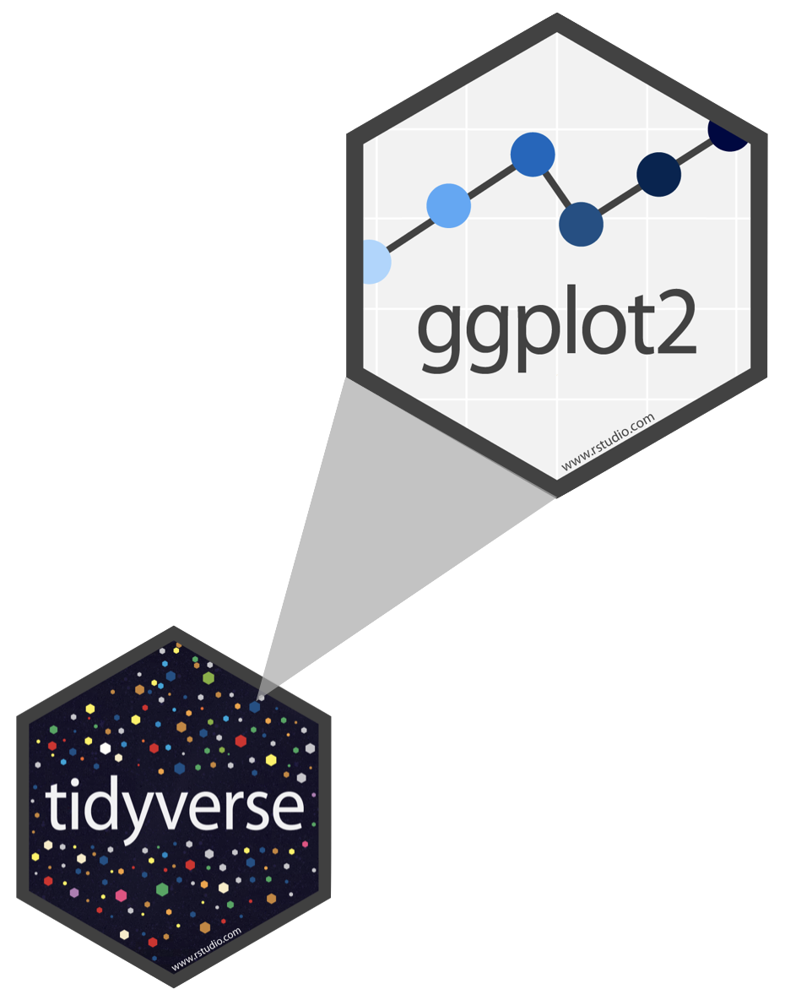

```{r setup, include = FALSE, cache = FALSE}
# generate CSS file
library(xaringanthemer)
style_xaringan(
  text_color = "#464A53",
  header_color = "#586891",
  background_color = "#F1F3F2",
  title_slide_background_color = "#586891",
  title_slide_text_color = "#F1F3F2",
  table_row_even_background_color = "#B3A6A3",
  link_color= "#586891",
  text_bold_color= "#586891",
  #code_highlight_color= rgba(255,255,0,0.5),
  inverse_text_color= "#464A53",
  inverse_background_color= "#B3A6A3",
  inverse_header_color= "#464A53",
  inverse_link_color= "#586891",
  header_background_color= "#586891",
  header_background_text_color= "#F1F3F2",
  code_highlight_color = "#9ab7c4",
  text_font_family = "Nunito",
  text_font_url = "https://fonts.google.com/specimen/Nunito?stroke=Sans+Serif",
  header_font_google = google_font("Afacad"),
  base_font_size= "28px",
  text_font_size= "1rem",
  code_font_size= "20px",
  footnote_font_size = "0.75em",
  code_inline_font_size= "1em",
  header_h1_font_size= "2rem",
  header_h2_font_size= "1.75rem",
  header_h3_font_size= "1.5rem")

source(here::here("R", "slide-opts.R"))

xaringanExtra::use_panelset()
ggplot2::theme_set(ggplot2::theme_gray(base_size = 16))
```

```{r pkgs, include = FALSE, cache = FALSE}
library(knitr)
library(here)
library(emojifont)
```

class: middle, inverse

# Data visualization: Agenda for today

* Basics of visualization
* Palmer penguins (!)
* Parts of a graph: 
  * aesthetics
    * color
    * shape
    * size
    * alpha (transparency)
  * faceting
* Prettying up
---

## Data visualization

> *"The simple graph has brought more information to the data analyst's mind than any other device."*
> 
> John Tukey

- Data visualization is the creation and study of the visual representation of data
- Many tools for visualizing data -- R is one of them
- Many approaches/systems within R for making data visualizations -- **ggplot2** is one of them, and that's what we're going to use

---

## ggplot2 $\in$ tidyverse

.pull-left[
```{r echo=FALSE, out.width="80%"}

```
] 
.pull-right[ 
- **ggplot2** is tidyverse's data visualization package 
- `gg` in "ggplot2" stands for Grammar of Graphics 
- Inspired by the book **Grammar of Graphics** by Leland Wilkinson
]

---

## Grammar of Graphics

.pull-left-narrow[
A grammar of graphics is a tool that enables us to concisely describe the components of a graphic
]
.pull-right-wide[
```{r echo=FALSE, out.width="60%"}
include_graphics("images/grammar-of-graphics.png")
```
]

.footnote[
Source: [BloggoType](http://bloggotype.blogspot.com/2016/08/holiday-notes2-grammar-of-graphics.html)
]


---

.pull-left[
**Mapping**

```{r warning = FALSE, out.width = "100%"}
ggplot(penguins,
       aes(x = bill_depth_mm,
           y = bill_length_mm,
           size = body_mass_g, #<< 
           alpha = flipper_length_mm)) + #<< 
  geom_point()
```
]
.pull-right[
**Setting**

```{r warning = FALSE, out.width = "100%"}
ggplot(penguins,
       aes(x = bill_depth_mm,
           y = bill_length_mm)) + 
  geom_point(size = 2, alpha = 0.5) #<< 
```
]

---

## Mapping vs. setting

- **Mapping:** Determine the size, alpha, etc. of points based on the values of a variable in the data
  - goes into `aes()`

- **Setting:** Determine the size, alpha, etc. of points **not** based on the values of a variable in the data
  - goes into `geom_*()` (this was `geom_point()` in the previous example, but we'll learn about other geoms soon!)
  
---

class: middle, inverse

# Faceting

---

## Faceting

- Smaller plots that display different subsets of the data
- Useful for exploring conditional relationships and large data

---

.panelset[
.panel[.panel-name[Plot]
```{r ref.label = "facet", echo = FALSE, warning = FALSE, out.width = "65%"}
```
]
.panel[.panel-name[Code]

```{r facet, fig.show = "hide"}
ggplot(penguins, aes(x = bill_depth_mm, y = bill_length_mm)) + 
  geom_point() +
  facet_grid(rows = vars(species), cols = vars(island)) #<< 
```
]
]

---

## Various ways to facet

.question[
In the next few slides describe what each plot displays. Think about how the code relates to the output.

**Note:** The plots in the next few slides do not have proper titles, axis labels, etc. because we want you to figure out what's happening in the plots.
But you should always label your plots!
]

---

```{r warning = FALSE, out.width = "65%"}
ggplot(penguins, aes(x = bill_depth_mm, y = bill_length_mm)) + 
  geom_point() +
  facet_grid(rows = vars(species), cols = vars(sex)) #<< 
```

---

```{r warning = FALSE, out.width = "65%"}
ggplot(penguins, aes(x = bill_depth_mm, y = bill_length_mm)) + 
  geom_point() +
  facet_grid(rows = vars(sex), cols = vars(species)) #<< 
```

---

```{r warning = FALSE, fig.asp = 0.5, out.width = "65%"}
ggplot(penguins, aes(x = bill_depth_mm, y = bill_length_mm)) + 
  geom_point() +
  facet_wrap(facets = vars(species)) #<< 
```

---

```{r warning = FALSE, fig.asp = 0.5}
ggplot(penguins, aes(x = bill_depth_mm, y = bill_length_mm)) + 
  geom_point() +
  facet_grid(rows = NULL, cols = vars(species)) #<< 
```

---

```{r warning = FALSE}
ggplot(penguins, aes(x = bill_depth_mm, y = bill_length_mm)) + 
  geom_point() +
  facet_wrap(facets = vars(species), ncol = 2) #<< 
```

---

## Faceting summary

- `facet_grid()`:
    - 2 dimensional grid
    - `rows = vars(<VARIABLE>), cols = vars(<VARIABLE>)`
    - Alternative: `rows ~ cols`
- `facet_wrap()`: 1 dimensional ribbon wrapped according to number of rows and columns specified or available plotting area

---

## Facet and color

.panelset[
.panel[.panel-name[Plot]
```{r ref.label = "facet-color-legend", echo = FALSE, warning = FALSE, out.width = "65%"}
```
]
.panel[.panel-name[Code]

```{r facet-color-legend, fig.show = "hide"}
ggplot(
  penguins, 
  aes(x = bill_depth_mm, 
      y = bill_length_mm, 
      color = species)) + #<< 
  geom_point() +
  facet_grid(species ~ sex) +
  scale_color_viridis_d() #<< 
```
]
]

---

## Facet and color, no legend

.panelset[
.panel[.panel-name[Plot]
```{r ref.label = "facet-color-no-legend", echo = FALSE, warning = FALSE, out.width = "65%"}
```
]
.panel[.panel-name[Code]

```{r facet-color-no-legend, fig.show = "hide"}
ggplot(
  penguins, 
  aes(x = bill_depth_mm, 
      y = bill_length_mm, 
      color = species)) +
  geom_point() +
  facet_grid(species ~ sex) +
  scale_color_viridis_d(guide = "none")  #<< 
```
]
]

---

class: middle, inverse

# Take a sad plot, and make it better

---

The American Association of 
University Professors (AAUP) is a nonprofit membership association of faculty 
and other academic professionals. 
[This report](https://www.aaup.org/sites/default/files/files/AAUP_Report_InstrStaff-75-11_apr2013.pdf) 
by the AAUP shows trends in instructional staff employees between 1975 
and 2011, and contains an image very similar to the one given below.

```{r echo=FALSE,out.width="70%",fig.align="center"}
include_graphics("images/staff-employment.png")
```

---

Each row in this dataset represents a faculty type, and the columns are the years for which we have data. 
The values are percentage of hires of that type of faculty for each year.

Download file: https://github.com/MACS40700/class_ex/blob/main/instructional-staff.csv

```{r load-data-staff, message=FALSE}
staff <- read_csv("data/instructional-staff.csv")
staff
```
.footnote[alt link: https://uchicago.box.com/s/eqk73widao74ysdd172ob81jac38ecjx]
---

## Recreate the visualization

In order to recreate this visualization we need to first reshape the data to have one variable for faculty type and one variable for year. In other words, we will convert the data from the long format to wide format. 

But before we do so... 

.task[
If the long data will have a row for each year/faculty type combination, and there are 5 faculty types and 11 years of data, how many rows will the data have?
]

---

class: center, middle

```{r echo = FALSE, out.width = "80%", fig.align = "center"}
include_graphics("images/pivot.gif")
```

---

# Brief aside: tidy data

```{r echo = FALSE, out.width = "80%", fig.align = "center"}
include_graphics("https://cdn.myportfolio.com/45214904-6a61-4e23-98d6-b140f8654a40/85520b8f-4629-4763-8a2a-9ceff27458bf_rw_1920.jpg?h=21007b20ac00cf37318dca645c215453")
```
---
# Brief aside: tidy data

```{r echo = FALSE, out.width = "80%", fig.align = "center"}
include_graphics("https://cdn.myportfolio.com/45214904-6a61-4e23-98d6-b140f8654a40/fc9b748b-db96-4ed4-aa23-f6e0ffc866ee_rw_1920.jpg?h=8fa394b572089354aa87b1d602b0f887")
```

---

## `pivot_*()` function

```{r echo=FALSE, out.width = "50%"}
include_graphics("https://github.com/gadenbuie/tidyexplain/raw/main/images/tidyr-pivoting.gif")
```

---

## `pivot_longer()`

```{r eval=FALSE}
pivot_longer(data, cols, names_to = "name", values_to = "value")
```

- The first argument is `data` as usual.
- The second argument, `cols`, is where you specify which columns to pivot 
into longer format -- in this case all columns except for the `faculty_type` 
- The third argument, `names_to`, is a string specifying the name of the column to create from the data stored in the column names of data -- in this case `year`
- The fourth argument, `values_to`, is a string specifying the name of the column to create from the data stored in cell values, in this case `percentage`

---

## Pivot instructor data

.small[
```{r}
library(tidyverse)

staff_long <- staff %>%
  pivot_longer(cols = -faculty_type, names_to = "year", 
               values_to = "percentage") %>%
  mutate(percentage = as.numeric(percentage))

staff_long
```
]

---

.question[
This doesn't look quite right, how would you fix it?
]

.small[
```{r fig.height=1.5}
staff_long %>%
  ggplot(aes(x = percentage, y = year, color = faculty_type)) +
  geom_col(position = "dodge")
```
]

---

.small[
```{r fig.height=1.5}
staff_long %>%
  ggplot(aes(x = percentage, y = year, fill = faculty_type)) +
  geom_col(position = "dodge")
```
]

---

## Some improvement...

.small[
```{r out.width = "60%"}
staff_long %>%
  ggplot(aes(x = percentage, y = year, fill = faculty_type)) +
  geom_col()
```
]

---

## More improvement

.small[
```{r out.width = "85%", fig.asp = 0.4, fig.width = 7}
staff_long %>%
  ggplot(aes(x = year, y = percentage, group = faculty_type, 
             color = faculty_type)) +
  geom_line() +
  theme_minimal()
```
]

---

## Goal: even more improvement!

.task[
I want to achieve the following look but I have no idea how!
]

```{r instructor-lines-for-show, echo = FALSE, out.width = "70%"}
include_graphics("images/sketch.png")
```

---

## Asking good questions

- Describe what you want
- Describe where you are
- Create a minimal **repr**oducible **ex**ample: `reprex::reprex()`

---

.panelset[
.panel[.panel-name[Plot]

```{r instructor-lines, echo = FALSE, fig.width = 7, out.width = "100%", fig.asp = 0.5}
library(scales)

staff_long %>%
  mutate( #<< 
    part_time = if_else(faculty_type == "Part-Time Faculty", #<< 
                        "Part-Time Faculty", "Other Faculty"), #<< 
    year = as.numeric(year) #<< 
    ) %>% #<< 
  ggplot(aes(x = year, y = percentage/100, group = faculty_type, 
             color = part_time)) +
  geom_line() +
  scale_color_manual(values = c("gray", "red")) + #<< 
  scale_y_continuous(labels = label_percent(accuracy = 1)) + #<< 
  theme_minimal() +
  labs(
    title = "Instructional staff employment trends",
    x = "Year", y = "Percentage", color = NULL
  ) +
  theme(legend.position = "bottom") #<< 
```

]

.panel[.panel-name[Code]

```{r ref.label = "instructor-lines", fig.show = "hide"}
```

]]

---

## Practice: Penguin challenge
Choose one of the following plots and explain why you think it is the best representation of the data. Describe a research question it might help you answer. Post on Ed -- be specific and reference the readings when possible.  

.panelset[
.panel[.panel-name[Facets]
```{r ref.label = "facet-color-no-legend", echo = FALSE, warning = FALSE, out.width = "45%"}
```
]
.panel[.panel-name[Alpha]
```{r ref.label = "alpha", echo = FALSE, warning = FALSE, out.width = "45%"}
```
]
.panel[.panel-name[Basic]
```{r ref.label="penguins-10-nohighlight", echo = FALSE, warning = FALSE, out.width = "45%"}
```
]
]

---
class: inverse

# Assignment 1

You need to find a graph and **critique** it (don't totally trash it -- this is an academic exercise). If you want you can work to make it better if you can get your hands on similar data. But if not, that's OK! 

---

# Speaking of: doing well on assignments

```{r echo = FALSE, out.width="65%"}

knitr::include_graphics("https://geekd-out.com/wp-content/uploads/2018/08/sugar-rush-featured-image.jpg")
```


---

# Recap

Parts of a graph:
* aesthetics
* color
* shape
* size
* alpha (transparency)
* faceting