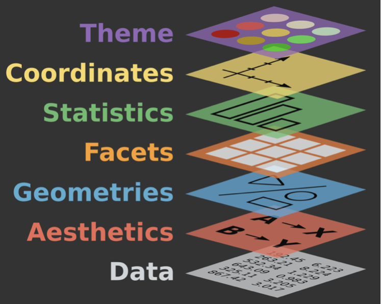
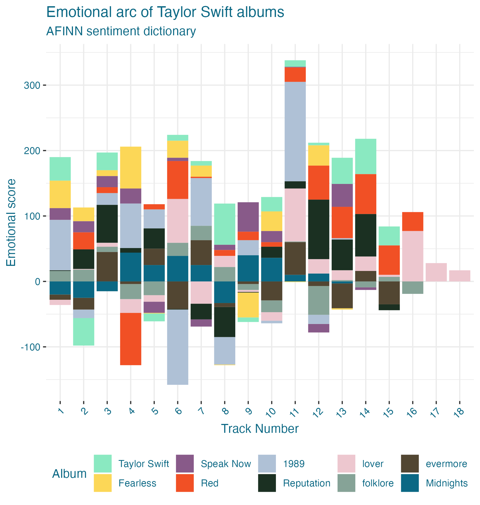
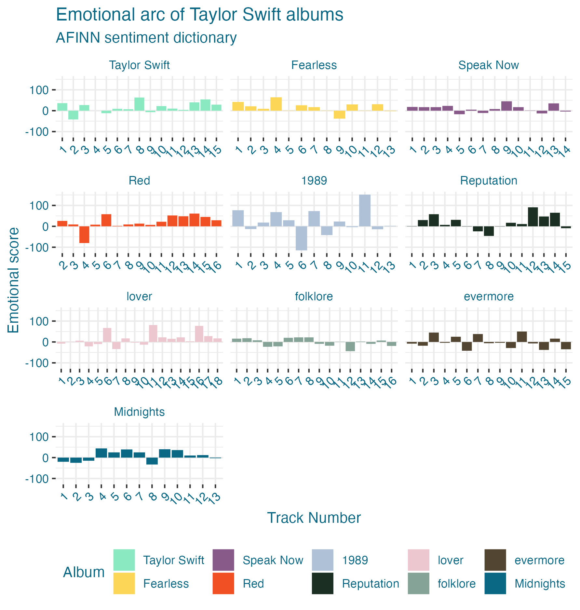

```{r setup, include = FALSE, cache = FALSE}
# generate CSS file


# source in the default knitr options
source(here::here("R", "slide-opts.R"))
knitr::opts_chunk$set(fig.align = "default", out.width = "30%")

# enable panelsets and default theme
xaringanExtra::use_panelset()
ggplot2::theme_set(ggplot2::theme_minimal(base_size = 16))

# load basic packages
library(knitr)
library(here)
library(countdown)
library(patchwork)
library(emoji)
library(maps)
library(ggwaffle)
library(mapproj)
library(ggthemes)
```

class: middle, inverse

# Agenda:
* Coordinate systems
* Aspect ratios
* `r emoji("no_good_woman")` Pie charts
* Coord maps
* Themes

---

## Announcements

* Grading up-to-date
* Feedback: formatting, technical details
* A2 coming up! (Jan 23)

---

## Setup

.small[
```{r message = FALSE, cache = FALSE}
# load packages
library(tidyverse)
library(knitr)
library(openintro)
library(palmerpenguins)
library(ggrepel)
library(ggwaffle) #devtools::install_github("liamgilbey/ggwaffle")
library(broom)

# set default theme for ggplot2
ggplot2::theme_set(ggplot2::theme_minimal(base_size = 16))

# set default figure parameters for knitr
knitr::opts_chunk$set(
  fig.width = 8, fig.asp = 0.618, fig.retina = 2,
  dpi = 150, out.width = "60%"
)

# dplyr print min and max
options(dplyr.print_max = 6, dplyr.print_min = 6)
```
]

---

class: middle, inverse

# Coordinate systems

---

## Coordinate systems: purpose

- Combine the two position aesthetics (`x` and `y`) to produce a 2d position on the plot:
  - linear coordinate system: horizontal and vertical coordinates 
  - polar coordinate system: angle and radius
  - maps: latitude and longitude

- Draw axes and panel backgrounds in coordination with the faceter coordinate systems

---

## Coordinate systems: types

1. **Linear coordinate systems:** preserve the shape of geoms


--
2. **Non-linear coordinate systems:** can change the shapes -- a straight line may no longer be straight. The closest distance between two points may no longer be a straight line.


---

## Coordinate systems: Linear

 **Linear coordinate systems:** preserve the shape of geoms

  - `coord_cartesian()`: the default Cartesian coordinate system, where the 2d position of an element is given by the combination of the x and y positions.
  - `coord_flip()`: Cartesian coordinate system with x and y axes flipped *(won't be using much now that geoms can take aesthetic mappings in x and y axes)*
  - `coord_fixed()`: Cartesian coordinate system with a fixed aspect ratio. *(useful only in limited circumstances)*

---

## Coordinate systems: Non-linear
 **Non-linear coordinate systems:** can change the shapes -- a straight line may no longer be straight. The closest distance between two points may no longer be a straight line.

  - `coord_trans()`: Apply arbitrary transformations to x and y positions, after the data has been processed by the stat
  - `coord_polar()`: Polar coordinates
  - `coord_map()` / `coord_quickmap()` / `coord_sf()`: Map projections

---

## Setting limits: what the plots say
Identify the differences: focus on the range of the `x` and `y` axes and the plots.
```{r cache = FALSE, echo = FALSE}
countdown(minutes = 5, top = 0)
```
.tiny[
```{r set-limits, out.width = "20%", fig.width = 6, fig.show = "hold", warning = FALSE, message = FALSE}
p <- ggplot(palmerpenguins::penguins, aes(x = flipper_length_mm, y = body_mass_g, color = species)) +
  geom_point() + geom_smooth() 

p + labs(title = "Plot 1")

p + scale_x_continuous(limits = c(190, 220)) + 
  scale_y_continuous(limits = c(4000, 5000)) + labs(title = "Plot 2")

p + xlim(190, 220) + ylim(4000, 5000) + labs(title = "Plot 3")

p + coord_cartesian(xlim = c(190,220), ylim = c(4000, 5000)) + labs(title = "Plot 4")
```
]

---

## Setting limits: what the plots say (plot closeup)

```{r ref.label = "set-limits", echo = FALSE, out.width= "35%"}
```
---

## Setting limits: what the warnings say

.tiny[
```{r ref.label = "set-limits", fig.show = "hide", message = FALSE, warning = TRUE, collapse = TRUE}
```
]

---

## Setting limits

- Setting scale limits: Any data outside the limits is thrown away
  - `scale_*_continuous()`, `xlim` and `ylim` arguments
  - `xlim()` and `ylim()`

- Setting coordinate system limits: Use all the data, but only display a small region of the plot (zooming in)
  - `coord_cartesian()`, `xlim` and `ylim` arguments

---
# DIDN'T WE SHOW THE OPPOSITE LAST WEEK?!!

.panelset[
.panel[.panel-name[Breaks]
.pull-left[
```{r breaks, fig.show = "hide"}
library(c3s2datasets)
ggplot(scorecard, 
       aes(x = netcost, 
           y = avgfacsal)) + 
  geom_point(alpha = 0.5) +
  scale_x_continuous(
    name = "Net cost of attendance",
    breaks = seq(from = 0, 
                 to = 30000, 
                 by = 10000) )
```
]
.pull-right[
```{r ref.label="breaks", echo = FALSE, out.width="90%"}
```
]
]
.panel[.panel-name[Limits]

.pull-left[
```{r limits, fig.show = "hide"}
library(c3s2datasets)
ggplot(scorecard, 
       aes(x = netcost, 
           y = avgfacsal)) + 
  geom_point(alpha = 0.5) +
  scale_x_continuous( 
    name = "Net cost of attendance" ) + 
  xlim(0,30000)
```
]

.pull-right[
```{r ref.label="limits", echo = FALSE, out.width="90%"}
```
]
]
]
---

## Fixing aspect ratio with `coord_fixed()`

Useful when having an aspect ratio of 1 makes sense, e.g. scores on two tests (reading and writing) on the same scale (0 to 100 points)

.tiny[
```{r out.width = "20%", fig.show = "hold", message = FALSE}
ggplot(hsb2, aes(x = read, y = write)) +
  geom_point() + geom_smooth(method = "lm") +
  geom_abline(intercept = 0, slope = 1, linetype = "dashed", color = "gray") +
  labs(title = "Not fixed")

ggplot(hsb2, aes(x = read, y = write)) +
  geom_point() + geom_smooth(method = "lm") +
  geom_abline(intercept = 0, slope = 1, linetype = "dashed", color = "gray") +
  coord_fixed() + labs(title = "Fixed")
```
]

---
# Plot closeup

```{r out.width = "50%", fig.show = "hold", message = FALSE, echo = FALSE}
ggplot(hsb2, aes(x = read, y = write)) +
  geom_point() + geom_smooth(method = "lm") +
  geom_abline(intercept = 0, slope = 1, linetype = "dashed", color = "gray") +
  labs(title = "Not fixed")

ggplot(hsb2, aes(x = read, y = write)) +
  geom_point() + geom_smooth(method = "lm") +
  geom_abline(intercept = 0, slope = 1, linetype = "dashed", color = "gray") +
  coord_fixed() + labs(title = "Fixed")
```

---

## Fixing aspect ratio with `tune::coord_obs_pred()`

.panelset[
.panel[.panel-name[Code]

```{r pred-data}
data(solubility_test, package = "modeldata")

p <- ggplot(solubility_test, aes(x = solubility, y = prediction)) +
  geom_abline(lty = 2) +
  geom_point(alpha = 0.5)

```
]

.panel[.panel-name[`coord_cartesian()`]
```{r pred-default, dependson = "pred-data"}
p + coord_cartesian()
```
]

.panel[.panel-name[`coord_fixed()`]
```{r pred-fixed, dependson = "pred-data"}
p + coord_fixed()
```
]

.panel[.panel-name[`coord_obs_pred()`]
```{r pred-tune, dependson = "pred-data"}
p + tune::coord_obs_pred()
```
]
]

---

## Transformations

.tiny[
```{r transformations, out.width = "25%", fig.width = 6, fig.show = "hold", warning = FALSE, message = FALSE}
p<- ggplot(penguins, aes(x = bill_depth_mm, y = body_mass_g)) +
  geom_point() + geom_smooth(method = "lm") 
  
  p + labs(title = "Plot 1")

p + scale_x_log10() + scale_y_log10() + labs(title = "Plot 2")

p + coord_trans(x = "log10", y = "log10") +  labs(title = "Plot 3")

ggplot(penguins, aes(x = log(bill_depth_mm, base = 10), y = log(body_mass_g, base = 10))) + #<<
  geom_point() + geom_smooth(method = "lm") + labs(title = "Plot 4")
```
]

---

## Pie charts and bullseye charts with `coord_polar()`

.small[
```{r out.width = "30%", fig.show = "hold", warning = FALSE, message = FALSE}
ggplot(penguins, aes(x = 1, fill = species)) +
  geom_bar() +
  labs(title = "Stacked bar chart")

ggplot(penguins, aes(x = 1, fill = species)) +
  geom_bar() +
  coord_polar(theta = "y") + #<<
  labs(title = "Pie chart")

ggplot(penguins, aes(x = 1, fill = species)) +
  geom_bar() +
  coord_polar(theta = "x") + #<<
  labs(title = "Bullseye chart")
```
]

---

class: middle, inverse

# aside: about pie charts...

---

## Pie charts

.task[
What do you know about pie charts and data visualization best practices? Love 'em or lose 'em?
]

```{r echo = FALSE, out.width = "45%"}
loans <- loans_full_schema %>%
  mutate(application_type = as.character(application_type)) %>%
  filter(application_type != "") %>%
  mutate(
    homeownership    = tolower(homeownership), 
    homeownership    = fct_relevel(homeownership, "rent", "mortgage", "own"), 
    application_type = fct_relevel(application_type, "joint", "individual")
    ) 

pie_homeownership <- loans %>% 
  mutate(homeownership = fct_infreq(homeownership)) %>%
  count(homeownership) %>%
  mutate(text_y = cumsum(n) - n/2) %>%
  ggplot(aes(x = "", fill = homeownership, y = n)) + 
  geom_col(position = position_stack(reverse = TRUE), show.legend = FALSE) +
  geom_text_repel(aes(x = 1, label = homeownership, y = text_y)) +
  coord_polar("y", start = 0) +
  scale_fill_openintro("hot") +
  theme_void(base_size = 16) +
  labs(title = "Homeownership")
pie_homeownership

pie_loan_grades <- loans %>% 
  count(grade) %>% 
  mutate(text_y = cumsum(n) - n/2) %>% 
  ggplot(aes(x = "", fill = grade, y = n)) + 
  geom_col(position = position_stack(reverse = TRUE), show.legend = FALSE) +
  geom_text_repel(aes(x = 1.4, label = grade, y = text_y), nudge_x = 0.3, segment.size = 0.5) + 
  coord_polar(theta = "y") + 
  scale_fill_openintro("cool") +
  theme_void(base_size = 16) +
  labs(title = "Loan grade")
pie_loan_grades
```

---

## Pie charts: when to love 'em, when to lose 'em

.pull-left-narrow[
`r emoji("heart")` For categorical variables with few levels, pie charts can sort of work well
]
.pull-right-wide[
```{r echo = FALSE, out.width = "50%"}
pie_homeownership

loans %>%
  ggplot(aes(x = homeownership, fill = homeownership)) +
  geom_bar(show.legend = FALSE) +
  scale_fill_openintro("hot") +
  labs(x = "Homeownership", y = "Count")
```
]

---
## Pie charts: when to love 'em, when to lose 'em

.pull-left-narrow[
`r emoji("broken_heart")` For categorical variables with many levels, pie charts are difficult to read
]
.pull-right-wide[
```{r echo = FALSE, out.width = "50%"}
pie_loan_grades

loans %>%
  ggplot(aes(x = grade, fill = grade)) +
  geom_bar(show.legend = FALSE) +
  scale_fill_openintro("cool") +
  labs(x = "Loan grade", y = "Count")
```
]

---

## Waffle charts

- Like with pie charts, work best when the number of levels represented is low
- Unlike pie charts, easier to compare proportions that represent non-simple fractions

.panelset[
.panel[.panel-name[Homeownership - Raw]
```{r out.width = "50%", fig.asp = 0.5, echo = FALSE}
library(ggwaffle)
# First plot - Homeownership RAW DATA
loans[1:600,] %>%  
  waffle_iron(aes_d(group = homeownership), rows = 35) %>%
  ggplot(aes(x = x, y = y, fill = group)) +
  labs(fill = NULL, title = "Homeownership") +
  geom_waffle() + 
  coord_equal() + 
  scale_fill_waffle() + 
  theme_waffle()
```
]

.panel[.panel-name[Homeownership - Transformed]
```{r out.width = "50%", fig.asp = 0.5, echo = FALSE}
# First plot - Homeownership TRANSFORMED DATA
loans_waffle <- loans %>%
  count(homeownership) %>%
  mutate(n_scaled = round(n / sum(n) * 100)) %>%
  uncount(n_scaled)

loans_waffle %>%
  waffle_iron(aes_d(group = homeownership), rows = 10) %>%
  ggplot(aes(x = x, y = y, fill = group)) +
  geom_waffle() +
  labs(fill = NULL, title = "Homeownership") +
  scale_fill_openintro("hot") +
  coord_equal() +
  theme_waffle() +
  theme(legend.position = "bottom")
```
]

.panel[.panel-name[Loan Status - Raw]
```{r out.width = "50%", fig.asp = 0.5, echo = FALSE}
# Second plot - Loan status -- RAW
loans[1:600,]  %>%
  waffle_iron(aes_d(group = loan_status), rows = 10) %>%
  ggplot(aes(x = x, y = y, fill = group)) +
  geom_waffle() +
  labs(fill = NULL, title = "Loan status") +
  coord_equal() +
  theme_waffle() +
  theme(legend.position = "bottom") +
  guides(fill = guide_legend(nrow = 2))
```
]

.panel[.panel-name[Loan Status - Transformed]
```{r out.width = "50%", fig.asp = 0.5, echo = FALSE}
# For loan_status TRANSFORMED
loans_waffle_status <- loans %>%
  count(loan_status) %>%
  mutate(n_scaled = round(n / sum(n) * 100)) %>%
  uncount(n_scaled)

loans_waffle_status %>%
  waffle_iron(aes_d(group = loan_status), rows = 10) %>%
  ggplot(aes(x = x, y = y, fill = group)) +
  geom_waffle() +
  labs(fill = NULL, title = "Loan status") +
  scale_fill_openintro("four") +
  coord_equal() +
  theme_waffle() +
  theme(legend.position = "bottom") +
  guides(fill = guide_legend(nrow = 2))
```
]
]


---

## Waffle charts: making of

.panelset[
.panel[.panel-name[Code]
```{r ref.label = "waffle-penguin", echo = TRUE, fig.show = "hide"}
```
]
.panel[.panel-name[Plot]
```{r waffle-penguin, echo = FALSE}
library(ggwaffle) #<<

penguins %>%
  waffle_iron(aes_d(group = species)) %>%
  ggplot(aes(x, y, fill = group)) +
  geom_waffle() + #<<
  labs(fill = NULL, title = "Penguin species")
```
]
]

---

## Waffle charts: enhanced theme

.panelset[
.panel[.panel-name[Code]
```{r ref.label = "waffle-penguin-theme", echo = TRUE, fig.show = "hide"}
```
]
.panel[.panel-name[Plot]
```{r waffle-penguin-theme, echo = FALSE}
penguins %>%
  waffle_iron(aes_d(group = species), rows = 10) %>%
  ggplot(aes(x, y, fill = group)) +
  geom_waffle() +  
  labs(fill = NULL, title = "Penguin species") +
  coord_equal() + #<<
  scale_fill_waffle() + #<<
  theme_waffle() #<<
```
]
]

---

class: middle, inverse

# back to coordinate systems...

---

## `coord_quickmap()`

.pull-left[
- Approximation sets aspect ratio: 1m of latitude & 1m of longitude are same distance in middle of plot
- Reasonable for smaller regions
- Fast
]
.pull-right[
.panelset[
.panel[.panel-name[Cartesian]
```{r out.width = "80%"}
ggplot(map_data("italy"), aes(long, lat, group = group)) +
  geom_polygon(fill = "white", color = "#008c45") +labs(x = NULL, y = NULL)
```
]
.panel[.panel-name[Quickmap]
```{r out.width = "80%"}
ggplot(map_data("italy"), aes(long, lat, group = group)) +
  geom_polygon(fill = "white", color = "#008c45") + labs(x = NULL, y = NULL) +
  coord_quickmap()
```
]
]
]

---

## `coord_map()`

- Uses the [**mapproj**](https://cran.r-project.org/package=mapproj) package
- Uses [Mercator projection](https://en.wikipedia.org/wiki/Mercator_projection) by default, with many other options via  `mapproj::mapproject() `
- Slower than `coord_quickmap()`


---

## `coord_map()`
.panelset[
.panel[.panel-name[Cartesian]
```{r out.width = "45%"}
ggplot(map_data("state"), aes(long, lat, group = group)) +
  geom_polygon(fill = "white", color = "#3c3b6e") + labs(x = NULL, y = NULL)
```
]
.panel[.panel-name[Mercator]
```{r out.width = "45%"}
ggplot(map_data("state"), aes(long, lat, group = group)) +
  geom_polygon(fill = "white", color = "#3c3b6e") + labs(x = NULL, y = NULL) +
  coord_map()
```
]
.panel[.panel-name[Stereographic]
```{r out.width = "45%"}
ggplot(map_data("state"), aes(long, lat, group = group)) +
  geom_polygon(fill = "white", color = "#3c3b6e") + labs(x = NULL, y = NULL) +
  coord_map(projection = "stereographic")
```
]
]


---

## Try it out!

.task[Create a map of a region or state you have visited]

--
```{r}
ggplot(map_data("county", "iowa"), aes(long, lat, group = group)) +
     geom_polygon(fill = "gray75", color = "black") + labs(x = NULL, y = NULL) +
     coord_map()
```


---

class: middle, inverse

# Facets: what if you want to break it down into sub-plots?

---

## `facet_*()`

.pull-left[
- `facet_wrap()` 
  - "wraps" a 1d ribbon of panels into 2d
  - generally for faceting by a single variable
- `facet_grid()` for faceting 
  - produces a 2d grid of panels defined by variables which form the rows and columns
  - generally for faceting by two variables
- `facet_null()`: a single plot, the default
]
.pull-right[
```{r echo = FALSE}

```
]

---

## Free the scales!

.small[
```{r free-all-scales, out.width = "50%", fig.asp = 0.5, fig.width = 8, fig.show = "hold", warning = FALSE, message = FALSE}
p <- ggplot(penguins, aes(x = flipper_length_mm, y = body_mass_g)) +
  geom_point()

p + 
  facet_wrap(vars(species)) + 
  labs(title = "Same scales")
p + 
  facet_wrap(vars(species), scales = "free") +
  labs(title = "Free scales")
```
]

---

## Free some scales

.small[
```{r free-some-scales, out.width = "50%", fig.asp = 0.5, fig.width = 8, fig.show = "hold", warning = FALSE, message = FALSE}
p +
  facet_wrap(vars(species), scales = "free_x") +
  labs(title = "Free x scale")
p +
  facet_wrap(vars(species), scales = "free_y") +
  labs(title = "Free y scale")
```
]

---

.task[
Freeing the y scale improves the display, but it's still not satisfying. What's wrong with it?
]

.small[
```{r free-scales-not-spaces, out.width = "50%", fig.asp = 0.5, fig.width = 8, fig.show = "hold", warning = FALSE, message = FALSE}
ggplot(penguins, aes(y = species, x = body_mass_g, fill = species)) +
  geom_boxplot(show.legend = FALSE) +
  facet_grid(island ~ .) +
  labs(title = "Same scale and spacing")

ggplot(penguins, aes(y = species, x = body_mass_g, fill = species)) +
  geom_boxplot(show.legend = FALSE) +
  facet_grid(island ~ ., scales = "free_y") +
  labs(title = "Free y scale, same spacing")
```
]

---

## Free spaces

```{r free-spaces, warning = FALSE, message = FALSE}
ggplot(penguins, aes(y = species, x = body_mass_g, fill = species)) +
  geom_boxplot(show.legend = FALSE) +
  facet_grid(island ~ ., scales = "free_y", space = "free") +
  labs(title = "Free y scale and spacing")
```

---

## Highlighting across facets: Option 1

```{r warning = FALSE, out.width = "50%"}
penguins_sans_species <- penguins %>% select(-species)

ggplot(penguins, aes(x = flipper_length_mm, y = body_mass_g)) +
  geom_point(data = penguins_sans_species, color = "gray") +
  geom_point(aes(color = species)) +
  facet_wrap(vars(species))
```


---

## Highlighting across facets: Option 2
```{r warning = FALSE, out.width = "50%"}
ggplot(penguins, aes(x = flipper_length_mm, y = body_mass_g)) +
  #geom_point(data = penguins_sans_species, color = "gray") +
  geom_point(aes(color = species)) +
  facet_wrap(vars(species)) +
gghighlight::gghighlight()
```

---
# Discussion

* When might it (not) be appropriate to use the following:
  * facets
  * free x
  * free y
  * free space
  * highlighting


---
# Discussion: TS

.pull-left[
```{r echo = FALSE, out.width="95%"}

```

]

.pull-right[
```{r echo = FALSE, out.width="95%"}

```
]

---

class: middle, inverse

# Themes

---

## Complete themes

```{r out.width = "33%", fig.show = "hold", fig.align = "default"}
p + theme_gray() + labs(title = "Gray")
p + theme_void() + labs(title = "Void")
p + theme_dark() + labs(title = "Dark")
```

---

## Themes from ggthemes

```{r out.width = "30%", fig.show = "hold", fig.align = "default"}
library(ggthemes)

p + theme_fivethirtyeight() + labs(title = "FiveThirtyEight")
p + theme_economist() + labs(title = "Economist")
p + theme_wsj() + labs(title = "Wall Street Journal")
```

---

## Themes and color scales from ggthemes

```{r warning = FALSE, message = FALSE, out.width = "40%"}
library(ggthemes)
p + 
  aes(color = species) +
  scale_color_wsj() +
  theme_wsj() + 
  labs(title = "Wall Street Journal")
```

---

## Modifying theme elements

```{r warning = FALSE, message = FALSE, fig.asp = 0.5, out.width = "60%"}
p + 
  labs(title = "Palmer penguins") +
  theme(
    plot.title = element_text(color = "red", face = "bold", family = "Comic Sans MS"),
    plot.background = element_rect(color = "red", fill = "mistyrose")
  )
```

---

---

# Custom themes!

* Can tweak existing
* Can google for your own (e.g. topic + ggplot)
  * Example: [TSwift custom themes](https://taylor.wjakethompson.com/articles/plotting)
* [Color brewer](https://r-graph-gallery.com/38-rcolorbrewers-palettes.html)

---

# examples: starting with TS and blues

```{r}
library(taylor)
library(ggplot2)
library(RColorBrewer)

reputation <- subset(taylor_album_songs, album_name == "reputation")
reputation$track_name <- factor(reputation$track_name, levels = reputation$track_name)


# Define the number of colors you want
nb.cols <- 17
blues17 <- colorRampPalette(brewer.pal(8, "Blues"))(nb.cols)

```
.footnote[[source](https://www.datanovia.com/en/blog/easy-way-to-expand-color-palettes-in-r/)]
---

# Same plot, different ways!


.panelset[
.panel[.panel-name[Blues Code]

```{r "blues", echo = TRUE, fig.show = "hide"}

p <- ggplot(reputation, aes(x = valence, y = track_name, fill = track_name)) +
  geom_col(show.legend = FALSE) +
  expand_limits(x = c(0, 1)) +
  labs(y = NULL) +
  theme_minimal() + 
  scale_fill_manual(values = blues17)
p
```
]
.panel[.panel-name[Blues Plot]
```{r blues, echo = FALSE, fig.show = TRUE}
```
]


.panel[.panel-name[Custom Code]

```{r "tv", echo = TRUE, fig.show = "hide"}

p + scale_fill_taylor_d(album = "reputation")
```
]
.panel[.panel-name[Custom Plot]
```{r tv, echo = FALSE, fig.show = TRUE}
```
]
]


---

# Other options: alternate themes
* https://emilhvitfeldt.github.io/paletteer/ 
* https://matthewbjane.github.io/ThemePark/ 
* https://datavizs24.classes.andrewheiss.com/resource/colors.html 
---
# Recap

* Coord systems: can change to linear/nonlinear
  * Coord_polar also interesting
* Geographic layer possible
* Themes: delightful