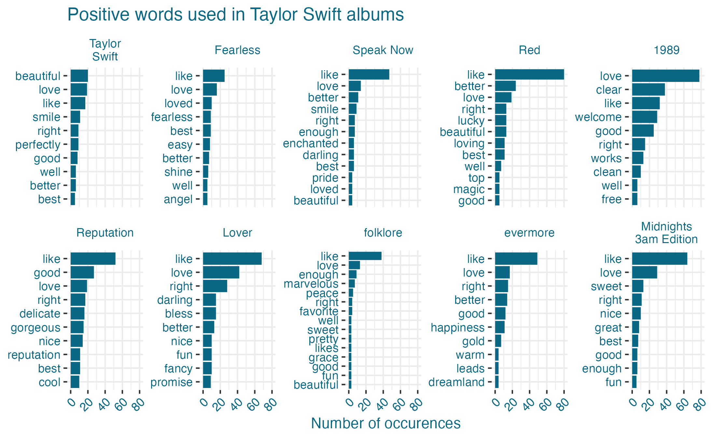
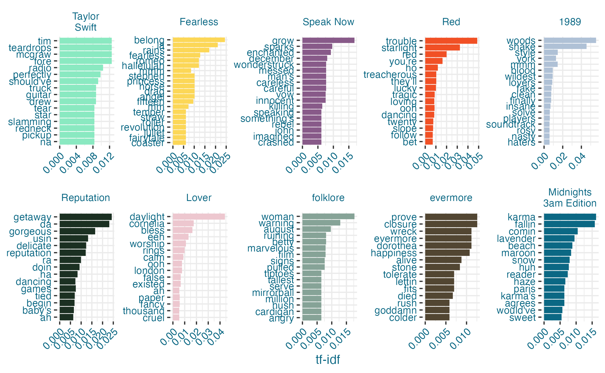
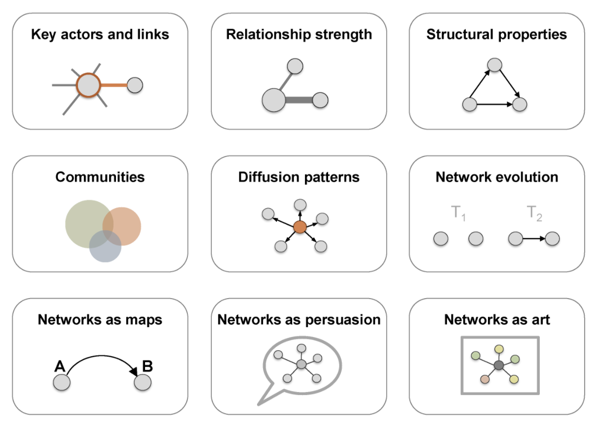
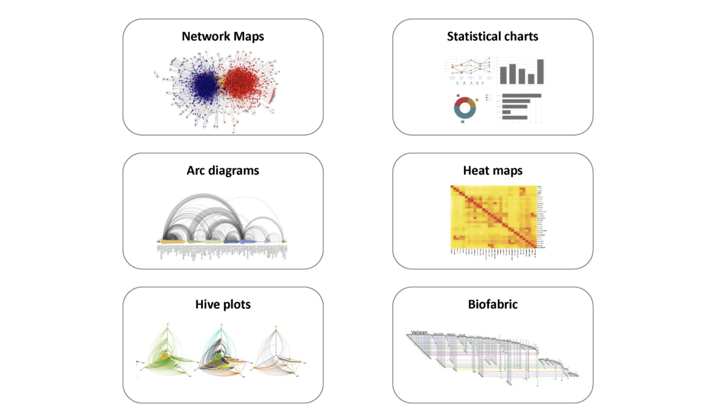

```{r setup, include = FALSE, cache = FALSE}
# generate CSS file
library(xaringanthemer)
#rcfss::xaringan_theme()

# source in the default knitr options
source(here::here("R", "slide-opts.R"))

# enable panelsets and default theme
xaringanExtra::use_panelset()
# ggplot2::theme_set(ggplot2::theme_minimal(base_size = 16))

# load basic packages
library(knitr)
library(here)
library(countdown)
library(patchwork)
library(flipbookr)
library(extrafont)
font_import()
```

## Setup

.small[
```{r message = FALSE, warning = FALSE}
# load packages
library(tidyverse)
library(tidytext)
library(ggtext)
library(glue)
library(ggwordcloud)
library(ggraph)
library(igraph)

# set default theme for ggplot2
ggplot2::theme_set(ggplot2::theme_minimal(base_size = 16))

# set default figure parameters for knitr
knitr::opts_chunk$set(
  fig.width = 8, fig.asp = 0.618, fig.retina = 2, dpi = 150, out.width = "60%"
)

# dplyr print min and max
options(dplyr.print_max = 10, dplyr.print_min = 10)
```
]

---

class: middle, inverse

# Text data


---

class: middle
```{r echo = FALSE}

```

---

## Text as data

Text can be represented as data in a variety of ways:

- **String**: Character vector

- **Corpus**: Raw strings annotated with additional metadata and details

- **Document-term matrix**: Sparse matrix describing a collection (i.e., a corpus) of documents with one row for each document and one column for each term, with word counts (or another measure of how common the word is in that text) as values

- **Word embeddings**: A dense array structure (typically a 3D array) describing a collection of documents where each word is projected onto an $n$-dimensional feature space that encodes the meaning of the words based on their semantic similarity

---

## Tidy text

- Each row is a **token**
  - A token can be a word, bigram (two words), ngram (n words), sentence, paragraph, etc.
- Each column is a variable
- Each type of observational unit is a row

---

class: center, middle, inverse

## Tidy text: Application
### Love Actually: popular *Christmas movie* ...
```{r echo = FALSE, message = FALSE}
love_actually <- read_csv(here::here("13-visualize-text-network", "data/love-actually.csv"))
```


---
## `Tidy text`: Application
```{r}
love_actually %>%
  slice_head(n = 6)
```


---

## Tokenize into words

With `tidytext::unnest_tokens()`:

```{r}
love_actually %>%
  unnest_tokens(
    output = word,    # first argument is output
    input = dialogue, # second argument is input
    token = "words"   # third argument is token, with default "words"
    ) %>%
  slice_head(n = 6)
```

---

## Most common words

.task[
Why do these words appear so commonly in Love Actually?
]

```{r}
love_actually %>%
  unnest_tokens(word, dialogue) %>%
  count(word, sort = TRUE)
```

---

## Stop words

- In computing, stop words are words which are filtered out before or after processing of natural language data (text)

- They usually refer to most common words in a language, but there is not a single list of stop words used by all natural language processing tools

.pull-left[
English:
.small[
```{r}
get_stopwords("en")
```
]
]

.pull-right[
Spanish:
.small[
```{r}
get_stopwords("es")
```
]
]

---

## Most common words

```{r}
love_actually %>%
  unnest_tokens(word, dialogue) %>%
  anti_join(stop_words) %>%
  count(word, sort = TRUE)
```

---

## Portuguese?!

```{r}
love_actually %>%
  filter(str_detect(dialogue, "[Pp]ortuguese"))
```

---

## Data cleaning

- Remove language identifiers

```{r}
love_actually <- love_actually %>%
  mutate(dialogue = str_remove(dialogue, "(Portuguese)"))
```

- Take another look

```{r}
love_actually %>%
  filter(str_detect(dialogue, "[Pp]ortuguese"))
```

---

## Most common words

Without "Portuguese"

```{r}
love_actually %>%
  unnest_tokens(word, dialogue) %>%
  anti_join(stop_words) %>%
  count(word, sort = TRUE)
```

---

## Visualizing Most common words

Visualize the top 10 words

.panelset.sideways[
```{r panelset = c(source = "Code", output = "Plot"), out.width = "100%", message = FALSE}
love_actually %>%
  unnest_tokens(word, dialogue) %>%
  anti_join(stop_words) %>%
  count(word, sort = TRUE) %>%
  slice_head(n = 10) %>% #<<
  ggplot(aes(y = word, x = n)) +
  geom_col()
```
]

---

## Visualizing Most common words

Reorder the words by frequency

.panelset.sideways[
```{r panelset = c(source = "Code", output = "Plot"), out.width = "100%", message = FALSE}
love_actually %>%
  unnest_tokens(word, dialogue) %>%
  anti_join(stop_words) %>%
  count(word, sort = TRUE) %>%
  slice_head(n = 10) %>%
  ggplot(aes(y = fct_reorder(word, n), x = n)) + #<<
  geom_col()
```
]

---

## Visualizing Most common words

Bring in some color

.panelset.sideways[
```{r panelset = c(source = "Code", output = "Plot"), out.width = "100%", message = FALSE}
love_actually %>%
  unnest_tokens(word, dialogue) %>%
  anti_join(stop_words) %>%
  count(word, sort = TRUE) %>%
  slice_head(n = 10) %>%
  ggplot(aes(y = fct_reorder(word, n), x = n)) +
  geom_col(fill = "#BD2D2A") + #<<
  labs(
    x = "Count", y = NULL,
    title = "Most common words in Love Actually"
  )
```
]

---

## Visualizing the most common words

Use `ggtext::element_textbox_simple()` to add color to title

.panelset.sideways[
```{r panelset = c(source = "Code", output = "Plot"), out.width = "100%", message = FALSE}
love_actually %>%
  unnest_tokens(word, dialogue) %>%
  anti_join(stop_words) %>%
  count(word, sort = TRUE) %>%
  slice_head(n = 10) %>%
  ggplot(aes(y = fct_reorder(word, n), x = n)) +
  geom_col(fill = "#BD2D2A") +
  labs(
    x = "Count", y = NULL,
    title = "<span style = 'color:#808080'>Most common words in</span>", #<<
    subtitle ="<span style = 'color:#BD2D2A;font-weight:strong'><b>love</b></span> actually" #<<
  ) +
  theme(
    plot.title = element_textbox_simple(halign = 1), #<<
    plot.subtitle = element_textbox_simple(size = 30, halign = 1), #<<
    plot.title.position = "plot" #<<
    )
```
]

---
### Beyond our scope: TD-IDF

There are additional measures of 'uniqueness' for words. 

```{r ts-idf, echo = FALSE}

```

---
## Skillz combo!

```{r, echo = FALSE, out.width = "75%"}
knitr::include_graphics("https://static01.nyt.com/images/2020/11/12/learning/ThanksgivingMapLN/ThanksgivingMapLN-superJumbo.png?quality=75&auto=webp")
```

.footnote[[Source: NYTimes 2020](https://www.nytimes.com/2020/11/12/learning/whats-going-on-in-this-graph-thanksgiving-side-dishes.html)]

---

## Wordclouds

Using `ggwordcloud::geom_text_wordcloud()`:

.panelset.sideways[
```{r panelset = c(source = "Code", output = "Plot"), out.width = "100%", message = FALSE}
set.seed(42)
love_actually %>%
  unnest_tokens(output = word, input = dialogue) %>%
  anti_join(stop_words) %>%
  count(word, sort = TRUE) %>%
  filter(n > 5) %>%
  ggplot(aes(label = word, size = n)) +
  geom_text_wordcloud() +
  scale_size_area(max_size = 10)
```
]

---

## Wordclouds, with color

.panelset.sideways[
```{r panelset = c(source = "Code", output = "Plot"), out.width = "100%", message = FALSE}
set.seed(42)
love_actually %>%
  unnest_tokens(output = word, input = dialogue) %>%
  anti_join(stop_words) %>%
  count(word, sort = TRUE) %>%
  filter(n > 5) %>%
  ggplot(aes(label = word, size = n)) +
  geom_text_wordcloud(aes(color = n)) + #<<
  scale_size_area(max_size = 10) +
  scale_color_distiller(palette = "Reds") #<<
```
]
---

## Wordclouds, with color (dark = popular)

.panelset.sideways[
```{r panelset = c(source = "Code", output = "Plot"), out.width = "100%", message = FALSE}
set.seed(42)
love_actually %>%
  unnest_tokens(output = word, input = dialogue) %>%
  anti_join(stop_words) %>%
  count(word, sort = TRUE) %>%
  filter(n > 5) %>%
  ggplot(aes(label = word, size = n)) +
  geom_text_wordcloud(aes(color = n)) + #<<
  scale_size_area(max_size = 10) +
  scale_color_distiller(palette = "Reds", direction = 1) #<<
```
]

---
class: inverse, center, middle

# Your turn!

---
# Activity: Make a visualization

- Find relevant data (see next slides for more detail)
  * If you are struggling -- you can use The Office data: 
- Remove stopwords
- Create a relevant visualization (e.g. top words)

```{r cache = FALSE, echo = FALSE}
countdown(minutes = 8)
```

---

## Activity: finding relevant data

* Honestly -- Kaggle can often be an easy source but probably not the best aside from quick / short projects
* Google: 'thing you care about' + 'dataset'
* APIs (see MACS 30550)
* Scraping (beyond our context MACS 30550 or MACS 30112/30122)

---
# Activity: guided (The Office) [step 1: load]

```{r echo = FALSE, message = FALSE}
library(tidyverse)
library(showtext)
library(tidytext)

font_import()

font_add_google("Courier Prime", "courier prime")
font_add_google("Miltonian", "miltonian")
showtext_auto()


office <- read_csv(here::here("13-visualize-text-network", "data/The-Office-Lines-V4.csv"))

```

Data source: [Kaggle Office data](https://www.kaggle.com/datasets/nasirkhalid24/the-office-us-complete-dialoguetranscript)

```{r}
office_words <- office %>%
  unnest_tokens(
    output = word,    # first argument is output
    input = line, # second argument is input
    token = "words"   # third argument is token, with default "words"
    ) 
  
office_words %>% 
  slice_head(n = 6)
```


---
# Activity: guided (The Office) [step2: no stopwords]

Notice what we have here -- why would this NOT be a good approach? 
```{r}
office_words %>% 
  anti_join(stop_words) %>%
  count(word, sort = TRUE)
```

---

.panelset.sideways[
```{r panelset = c(source = "Code", output = "Plot"), out.width = "100%", message = FALSE}

custom_words <-data.frame("word" = c("hey", "uh", "um")) #<<
custom_words <- full_join(stop_words, custom_words) #<<
char_names <- c("michael", "jim", "dwight", "pam") #<<
office_words %>%
  anti_join(custom_words) %>%
  count(word, sort = TRUE) %>%
  mutate(character = ifelse( word %in% char_names, "yes","no")) %>% 
  slice_head(n = 10) %>%
  ggplot(aes(y = fct_reorder(word, n), x = n, fill = character)) +
  geom_col() + scale_fill_manual(values  = c("yes" = "#2B152C", "no" = "#B3A6A3")) +
  labs(
    x = "Count", y = NULL,
    title = "<span style = 'color:#808080'>Most common words in</span>",  
    subtitle ="<b>The Office</b>"  
  ) +
  theme(
    plot.title = element_textbox_simple(halign = 1),  
    plot.subtitle = element_textbox_simple(size = 30, halign = 1, family = "courier prime"),  
    plot.title.position = "plot"  
    
    )
```
]

---

# Closing thoughts:

* What did we do well in our previous graphic? 
* How might we improve? 

---


class: inverse, middle

# Network data

---

## Network data

- A **network** refers to an object composed of elements and relationships or connections between those elements

--
- **Network analysis** is a collection of techniques for examining the relationships between entities, and depicting the structure of those relationships
  - Network analysis spans a number of domains, including social networks, bibliometrics, epidemiology, bioinformatics, complex systems, and text analysis

--
- **Graph theory** provides the formal basis for network analysis, across domains, and provides a common language for describing the structure of networks

--
- **Network visualization** involves the visualization of the relationships (edges or links) between data elements (nodes)

---

## Purpose

Main concern in designing a network visualization is the purpose it has to serve:

- What are the structural properties that we want to highlight?
- What are the key concerns we want to address?

```{r echo = FALSE, out.width = "50%", fig.align = "center"}

```


.footnote[
Source: https://kateto.net/network-visualization
]

---

## Format

- Network maps are not the only visualization appropriate for graphs

- Other network representation formats, including simple charts of key characteristics, may be more appropriate in some cases

```{r echo = FALSE, out.width = "50%", fig.align = "center"}

```

.footnote[
Source: https://kateto.net/network-visualization
]

---

## Bigrams as tokens

**Bigram** is a sequence of two adjacent elements ferom a string of tokens, e.g., two consecutive words

```{r}
bigrams <- love_actually %>%
  unnest_tokens(bigram, dialogue, token = "ngrams", n = 2)

bigrams
```

---

## Most common bigrams

```{r}
bigrams %>%
  count(bigram, sort = TRUE)
```

---

## Removing stop words from bigrams

Step 1: Separate the bigram into words

```{r}
bigrams_separated <- bigrams %>%
  separate(bigram, c("word1", "word2"), sep = " ")

bigrams_separated
```

---

## Removing stop words from bigrams

Step 2: Remove bigram if either word is a stop word

```{r}
bigrams_filtered <- bigrams_separated %>%
  filter(!(word1 %in% stop_words$word)) %>%
  filter(!(word2 %in% stop_words$word))

bigrams_filtered
```

---

## Removing stop words from bigrams

Step 3: Put the bigrams back together

```{r}
bigrams_united <- bigrams_filtered %>%
  unite(bigram, word1, word2, sep = " ")

bigrams_united
```

---

## Most common bigrams, again

Hmm...

```{r}
bigrams_united %>%
  count(bigram, sort = TRUE)
```

---

## Most common bigrams, again

```{r}
bigrams_united <- bigrams_united %>%
  filter(bigram != "NA NA")

bigrams_united %>%
  count(bigram, sort = TRUE)
```

---

## Visualizing the most common bigrams

.panelset.sideways[
```{r panelset = c(source = "Code", output = "Plot"), out.width = "100%", message = FALSE}
bigrams_united %>%
  count(bigram, sort = TRUE) %>%
  slice_head(n = 10) %>%
  ggplot(aes(y = fct_reorder(bigram, n), x = n)) +
  geom_col(fill = "#BD2D2A") +
  labs(
    x = "Count", y = NULL,
    title = "<span style = 'color:#808080'>Most common bigrams in</span>", #<<
    subtitle ="<span style = 'color:#BD2D2A;font-weight:strong'><b>love</b></span> actually" #<<
  ) +
  theme(
    plot.title = element_textbox_simple(halign = 1), #<<
    plot.subtitle = element_textbox_simple(size = 30, halign = 1), #<<
    plot.title.position = "plot" #<<
    )
```
]

---

## Network of bigrams

- We may be interested in visualizing all of the relationships among words simultaneously, rather than just the top few at a time

- One approach is to arrange the words into a network (or "graph")
  - Here, "graph" is not in the sense of a visualization, but as a combination of connected nodes
  
- A graph can be constructed from a tidy object since it has three variables:
  - **from**: the node an edge is coming from
  - **to**: the node an edge is going towards
  - **weight**: a numeric value associated with each edge

---

## From tidy data frame to graph

Using `igraph::graph_from_data_frame()`:

```{r}
bigram_graph <- bigrams_united %>%
  separate(bigram, c("word1", "word2"), sep = " ") %>%
  count(word1, word2, sort = TRUE) %>%
  filter(n > 1) %>%       # filter for bigrams that occur more than once
  graph_from_data_frame()

bigram_graph
```

---

## Visualizing the network of bigrams

Common bigrams in Love Actually that occurred more than once and where neither word was a stop word

```{r echo = FALSE, out.width = "75%"}
set.seed(42)
ggraph(bigram_graph, layout = "fr") +
  geom_edge_link() +
  geom_node_point() +
  geom_node_text(aes(label = name), vjust = 1, hjust = 1)
```

---

## Visualizing the network of bigrams

Step 1. Set up the plot object with `ggraph::ggraph()`:

```{r out.width = "75%"}
set.seed(42)
ggraph(bigram_graph)
```

---

## Visualizing the network of bigrams

Step 2. Add edges

```{r out.width = "50%"}
set.seed(42)
ggraph(bigram_graph) +
  geom_edge_link()
```

---

## Visualizing the network of bigrams

Step 3. Add nodes

```{r out.width = "50%"}
set.seed(42)
ggraph(bigram_graph) +
  geom_edge_link() +
  geom_node_point()
```

---

## Visualizing the network of bigrams

Step 4. Add text

```{r out.width = "45%"}
set.seed(42)
ggraph(bigram_graph) +
  geom_edge_link() +
  geom_node_point() +
  geom_node_text(aes(label = name))
```

---

## Visualizing the network of bigrams

Step 5. Consider layouts

```{r out.width = "35%", echo = FALSE, fig.align = "default"}
set.seed(42)
ggraph(bigram_graph, layout = "stress") +
  geom_edge_link() +
  geom_node_point() +
  geom_node_text(aes(label = name)) +
  labs(title = "layout: stress")

set.seed(42)
ggraph(bigram_graph, layout = "fr") +
  geom_edge_link() +
  geom_node_point() +
  geom_node_text(aes(label = name)) +
  labs(title = "layout: fr")
```

```{r out.width = "35%", echo = FALSE, fig.align = "default"}
set.seed(42)
ggraph(bigram_graph, layout = "lgl") +
  geom_edge_link() +
  geom_node_point() +
  geom_node_text(aes(label = name)) +
  labs(title = "layout: lgl")

set.seed(42)
ggraph(bigram_graph, layout = "graphopt") +
  geom_edge_link() +
  geom_node_point() +
  geom_node_text(aes(label = name)) +
  labs(title = "layout: graphopt")
```

---

## Visualizing the network of bigrams

Step 6. Pick a layout

```{r out.width = "50%"}
set.seed(42)
ggraph(bigram_graph, layout = "fr") +
  geom_edge_link() +
  geom_node_point() +
  geom_node_text(aes(label = name))
```

---

## Visualizing the network of bigrams

Step 7. Adjust text

```{r out.width = "50%"}
set.seed(42)
ggraph(bigram_graph, layout = "fr") +
  geom_edge_link() +
  geom_node_point() +
  geom_node_text(aes(label = name), hjust = 1, vjust = 1)
```

---

## Visualizing the network of bigrams

Step 8. Add more context with `edge_alpha = n`

.panelset.sideways[
```{r panelset = c(source = "Code", output = "Plot"), out.width = "100%", message = FALSE}
a <- grid::arrow(type = "closed", length = unit(0.1, "inches"))

set.seed(42)
ggraph(bigram_graph, layout = "fr") +
  geom_edge_link(aes(edge_alpha = n), show.legend = FALSE,
                 arrow = a, end_cap = circle(0.01, "inches")) +
  geom_node_point(color = "lightpink", size = 3) +
  geom_node_text(aes(label = name), vjust = 1, hjust = 1)
```
]


---
# Application: Continue with your data

* Find bigrams
* Visualize


Build on your prior data to explore word occurrences


---
# Application: Office walk-through


```{r include = FALSE}
bigrams_united_office <- office %>% unnest_tokens(bigram, line, token = "ngrams", n = 2) %>%
  separate(bigram, c("word1", "word2"), sep = " ") %>%
  filter(!(word1 %in% stop_words$word)) %>%
  filter(!(word2 %in% stop_words$word)) %>%
  filter(!(word1 %in% c("NA", "na"))) %>%
  filter(!(word2 %in% c("NA", "na"))) %>%
  unite(bigram, word1, word2, sep = " ")

bigram_graph_office <- bigrams_united_office %>%
  separate(bigram, c("word1", "word2"), sep = " ") %>%
  count(word1, word2, sort = TRUE) %>%
  filter(n > 15) %>%       # filter for bigrams that occur more than once
  graph_from_data_frame()
```

.panelset.sideways[
```{r panelset = c(source = "Code", output = "Plot"), out.width = "100%", message = FALSE}
a <- grid::arrow(type = "closed", length = unit(0.1, "inches"))

set.seed(42)
ggraph(bigram_graph_office, layout = "fr") +
  geom_edge_link(aes(edge_alpha = log(n)), show.legend = FALSE,
                 arrow = a, end_cap = circle(0.01, "inches")) +
  geom_node_point(color = "#B3A6A3") +
  geom_node_text(aes(label = name), vjust = 1, hjust = 1)

```
]


---
class: center, middle, inverse

# Networks: character co-occurrence
### (you may not have the data to be able to do this)
---

## Main characters

```{r message = FALSE}
main_characters <- read_csv(here::here("13-visualize-text-network", "data/love-actually-cast.csv"))
```

.pull-left[
```{r}
main_characters %>% slice(1:10)
```
]
.pull-right[
```{r}
main_characters %>% slice(11:20)
```
]

---

## Dialogues for main characters

```{r}
love_actually <- love_actually %>%
  inner_join(main_characters) %>%
  mutate(character = glue("{speaker} ({actor})"))

dim(love_actually)
```

---

## Lines-per-scene-per-character

```{r}
character_scene_counts <- love_actually %>%
    count(scene, character)

character_scene_counts
```

---

## Look who's talking to whom

```{r out.width = "60%"}
character_scene_counts %>%
  ggplot(aes(x = scene, y = character)) +
  geom_point() +
  geom_path(aes(group = scene))
```

---

## Identify monologues

```{r}
character_scene_counts %>%
  group_by(scene) %>%
  mutate(conversation = if_else(n() == 1, "monologue", "not monologue"))
```

---

## Look who's talking to whom, again

.task[
What's happening in the last scene?
]

.panelset.sideways[
```{r panelset = c(source = "Code", output = "Plot"), out.width = "100%", message = FALSE}
character_scene_counts %>%
  group_by(scene) %>%
  mutate(conversation = if_else(n() == 1, "monologue", "not monologue")) %>%
  filter(conversation == "not monologue") %>%
  ggplot(aes(x = scene, y = character)) +
  geom_point() +
  geom_path(aes(group = scene))
```
]

---

## Remove the last scene

So that it doesn't look like everyone is connected to each other in the network

```{r}
character_scene_counts <- character_scene_counts %>%
  filter(scene != max(character_scene_counts$scene))
```

---

## Character scene "matrix"

Each row is a character, each column is a scene

.small[
```{r}
character_scene_counts %>%
  pivot_wider(
    names_from = scene,
    values_from = n
  )
```
]

---

## Character scene "matrix"

... and each cell is a 0/1 depending on whether that combination ever occurred

.small[
```{r}
character_scene_occurences <- character_scene_counts %>%
  pivot_wider(
    names_from = scene,
    names_prefix = "s",
    values_from = n,
    values_fn = length,
    values_fill = 0
  )

character_scene_occurences
```
]

---

## Actually as a matrix

.small[
```{r}
character_scene_matrix <- character_scene_occurences %>%
  column_to_rownames(var = "character") %>%
  as.matrix()

character_scene_matrix
```
]

---

## Calculate co-occurrences

.small[
```{r}
cooccur <- character_scene_matrix %*% t(character_scene_matrix)

cooccur
```
]

---

## Convert to a graph

Using `igraph::graph_from_adjacency_matrix()`:

.small[
```{r}
cooccur_graph <- graph_from_adjacency_matrix(
  cooccur, 
  weighted = TRUE, 
  mode = "undirected", 
  diag = FALSE         # don't include diagonals
  )

cooccur_graph
```
]

---

## Visualizing co-occurences

.panelset.sideways[
```{r panelset = c(source = "Code", output = "Plot"), out.width = "100%", message = FALSE}
set.seed(42)
ggraph(cooccur_graph, layout = "fr") +
  geom_edge_link(color = "gray") +
  geom_node_point(color = "lightpink", size = 3) +
  geom_node_text(aes(label = name), hjust = 0.2, vjust = 1)
```
]

---
### Co-occurences: The Office

.panelset.sideways[
```{r panelset = c(source = "Code", output = "Plot"), out.width = "100%", message = FALSE}

char_names <- c("michael", "jim", "dwight", "pam", "angela", "bob", "phyllis", "oscar", "creed", "kevin", "stanley", "andy", "kelly", "toby", "robert", "nellie", "todd", "jan", "carol", "ryan", "meredith", "holly", "david", "karen", "jo") 
character_scene_counts_office <- office %>% 
    count(scene, speaker, season, episode) 

character_scene_counts_office %>% filter(speaker %in% str_to_sentence(char_names)) %>%
  filter(season == 1 & episode == 1) %>% 
  ggplot(aes(x = scene, y = speaker)) +
  geom_point() +
  geom_path(aes(group = scene))
```
]

---
### Co-occurences: The Office

```{r}
character_scene_matrix_office <- character_scene_counts_office %>%
  filter(speaker %in% str_to_sentence(char_names)) %>%
  filter(season < 4) %>%
  group_by(season, episode, scene)  %>%
  pivot_wider(
    names_from = c(season, episode, scene),
    names_prefix = "s",
    values_from = n,
    values_fn = length,
    values_fill = 0 ) %>%
  column_to_rownames(var = "speaker") %>%
  as.matrix()  
  
  cooccur_office <- character_scene_matrix_office %*% t(character_scene_matrix_office)

cooccur_office <- graph_from_adjacency_matrix(
  cooccur_office, 
  weighted = TRUE, 
  mode = "undirected", 
  diag = FALSE )        # don't include diagonals 
```
---
### Co-occurences: The Office


.panelset.sideways[
```{r panelset = c(source = "Code", output = "Plot"), out.width = "100%", message = FALSE}
set.seed(42)
ggraph(cooccur_office, layout = "fr") +
  geom_edge_link(color = "gray") +
  geom_node_point(color = "#2B152C", size = 3) +
  geom_node_text(aes(label = name), hjust = 0.2, vjust = 1, repel = TRUE)
```
]


---
# `set.seed()` 
Play around setting different values for the seed for your visualization


.panelset.sideways[
```{r panelset = c(source = "Code", output = "Plot"), out.width = "100%", message = FALSE}
set.seed(13)
ggraph(cooccur_office, layout = "fr") +
  geom_edge_link(color = "gray") +
  geom_node_point(color = "#2B152C", size = 3) +
  geom_node_text(aes(label = name), hjust = 0.2, vjust = 1, repel = TRUE)
```
]

---
# Recap

* WORDCLOUDS ARE NOT ANALYSIS
* Think about your data structure for what makes sense for your analysis
* Networks are good for connections
* Language plays a key role when doing text analysis -- how do you think about what does/not have meaning? 


---

## Acknowledgements

- [Analyzing networks of characters in 'Love Actually'](http://varianceexplained.org/r/love-actually-network/) by David Robinson

- [Text Mining with R](https://www.tidytextmining.com/) by Julia Silge and David Robinson

- [Office Dataset](https://www.kaggle.com/datasets/nehaprabhavalkar/the-office-dataset/versions/5?resource=download)
