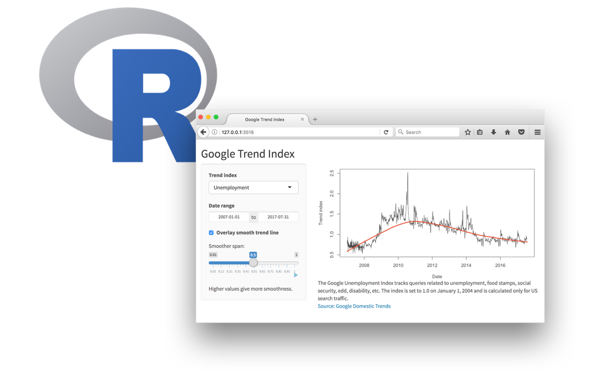
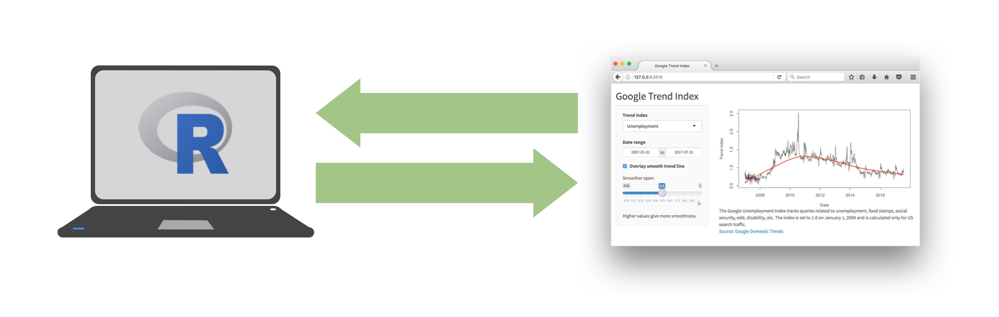
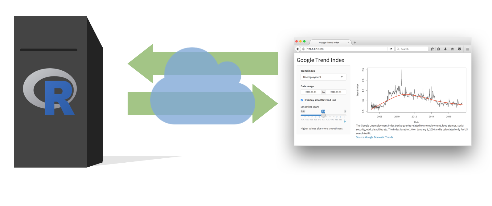
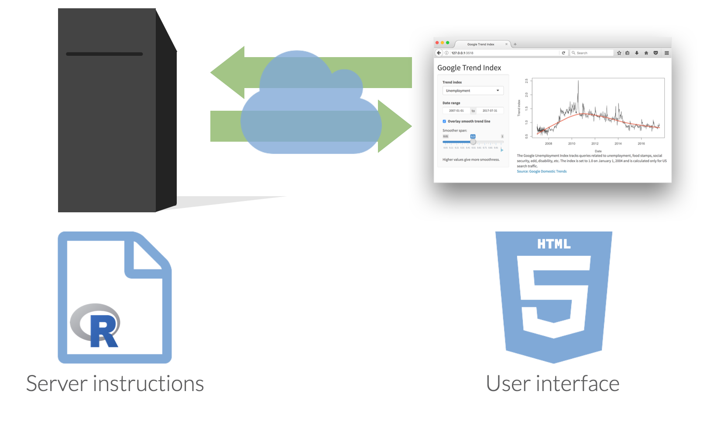

```{r setup, include = FALSE, cache = FALSE}
# generate CSS file
library(xaringanthemer)
style_xaringan(
  text_color = "#464A53",
  header_color = "#586891",
  background_color = "#F1F3F2",
  title_slide_background_color = "#586891",
  title_slide_text_color = "#F1F3F2",
  table_row_even_background_color = "#B3A6A3",
  link_color= "#586891",
  text_bold_color= "#586891",
  #code_highlight_color= rgba(255,255,0,0.5),
  inverse_text_color= "#464A53",
  inverse_background_color= "#B3A6A3",
  inverse_header_color= "#464A53",
  inverse_link_color= "#586891",
  header_background_color= "#586891",
  header_background_text_color= "#F1F3F2",
  code_highlight_color = "#9ab7c4",
  text_font_family = "Nunito",
  text_font_url = "https://fonts.google.com/specimen/Nunito?stroke=Sans+Serif",
  header_font_google = google_font("Afacad"),
  base_font_size= "28px",
  text_font_size= "1rem",
  code_font_size= "20px",
  footnote_font_size = "0.75em",
  code_inline_font_size= "1em",
  header_h1_font_size= "2rem",
  header_h2_font_size= "1.75rem",
  header_h3_font_size= "1.5rem")


# source in the default knitr options
source(here::here("R", "slide-opts.R"))

# enable panelsets and default theme
xaringanExtra::use_panelset()
# ggplot2::theme_set(ggplot2::theme_minimal(base_size = 16))

# load basic packages
library(knitr)
library(here)
library(countdown)
library(patchwork)
library(flipbookr)
library(scales)
library(ggtext)
```

class: inverse

# Agenda

* What is Shiny
* Examples
* NEED THE FOLLOWING:
  * relevant packages: `shiny`, `tayloR`
  * github repo for exercises: 
  * start with **sandbox**
---

class: middle, inverse

# Setup

---

## Setup

```{r message = FALSE, warning = FALSE}
# load packages
library(tidyverse)
library(shiny)

# set default theme for ggplot2
ggplot2::theme_set(ggplot2::theme_minimal(base_size = 16))

# set default figure parameters for knitr
knitr::opts_chunk$set(
  fig.width = 8, fig.asp = 0.618, fig.retina = 2, dpi = 150, out.width = "60%"
)

# dplyr print min and max
options(dplyr.print_max = 10, dplyr.print_min = 10)
```

---

class: middle, inverse

# Shiny: High level view

---

class: middle, center

.center[
Every Shiny app has a webpage that the user visits, <br> and behind this webpage there is a computer that serves this webpage by running R.
]

```{r echo = FALSE, out.width = "80%"}

```

---

class: middle, center

.center[
When running your app locally, the computer serving your app is your computer.
]

```{r echo = FALSE, out.width = "100%"}

```

---

class: middle, center

.center[
When your app is deployed, the computer serving your app is a web server.
]

```{r echo = FALSE, out.width = "100%"}

```

---

class: middle, center

```{r echo = FALSE, out.width = "100%"}

```

---

class: inverse, middle

# Dating rules

---

## Age gaps

```{r aged, include = FALSE}
# source: Dataclysm, pages 42-43
pref_women <- tibble(
  age = 20:50,
  pref = c(23, 23, 24, 25, 25, 26, 27, 28, 29, 29, 30, 31, 31, 32, 32,34, 35, 36, 37, 38, 38, 38, 39, 39, 39, 40, 38, 39, 40, 45, 46)
)
pref_men <- tibble(
  age = 20:50,
  pref = c(20, 20, 21, 21, 21, 21, 22, 21, rep(20, times = 9), 22, 20, 20, 21, 21, 20, 23, 21, 24, 20, 20, 23, 20, 22)
)
```

.pull-left[

```{r women, echo = FALSE, fig.asp = 1, out.width = "95%"}
ggplot(data = pref_women, mapping = aes(x = pref, y = age, label = pref)) +
  geom_abline(slope = -1, linetype = 2, alpha = .5) +
  geom_text(color = "#f542b3", family = "Roboto Condensed", size = 4) +
  scale_x_continuous(breaks = NULL, limits = c(20, 50)) +
  scale_y_reverse(breaks = 20:50) +
  coord_fixed() +
  labs(
    title = "A woman´s age <span style = 'color:#f542b3'>vs. the age of the men who look best to her</span>",
    x = NULL,
    y = NULL,
    caption = "Source: *Cataclysm* and OKCupid.com"
  ) +
  theme_classic(base_family = "Roboto Condensed", base_size = 16) +
  theme(
    axis.line = element_blank(),
    axis.ticks = element_blank(),
    plot.title = element_markdown(face = "italic"),
    plot.caption = element_markdown()
  )
```
]

--

.pull-right[

```{r men, echo = FALSE, fig.asp = 1, out.width = "95%"}
ggplot(data = pref_men, mapping = aes(x = pref, y = age, label = pref)) +
  geom_abline(slope = -1, linetype = 2, alpha = .5) +
  geom_text(color = "#9ab7c4", family = "Roboto Condensed", size = 4) +
  scale_x_continuous(breaks = NULL, limits = c(20, 50)) +
  scale_y_reverse(breaks = 20:50) +
  coord_fixed() +
  labs(
    title = "A man´s age <span style = 'color:#9ab7c4'>vs. the age of the women who look best to him</span>",
    x = NULL,
    y = NULL,
    caption = "Source: *Cataclysm* and OKCupid.com"
  ) +
  theme_classic(base_family = "Roboto Condensed", base_size = 16) +
  theme(
    axis.line = element_blank(),
    axis.ticks = element_blank(),
    plot.title = element_markdown(face = "italic"),
    plot.caption = element_markdown()
  )
```

]

---

## Dating rules

- [A Shiny app for determining if this relationship is skeezy](https://jclip.shinyapps.io/age-rule/)

```{r fig.width = 3, echo = FALSE}
library(tweetrmd)
# <blockquote class="twitter-tweet" data-lang="en"><p lang="en" dir="ltr"><a href="https://twitter.com/hashtag/RedTaylorsVersion?src=hash&amp;ref_src=twsrc%5Etfw">#RedTaylorsVersion</a>, Txaylor Swift sings &quot;I&#39;ll get older, but your lovers stay my age&quot;<br><br>As a connoisseur of pop culture &amp; statistics, I obviously had to analyze this 🤓<br><br>Verdict: there is a significant interaction of Year x Person on Age across Jake&#39;s relationships (p = 0.0084) <a href="https://t.co/nZBs7RhWDS">pic.twitter.com/nZBs7RhWDS</a></p>&mdash; Celine St. Pierre (@stpierreceline) <a href="https://twitter.com/stpierreceline/status/1460680119454945291?ref_src=twsrc%5Etfw">November 16, 2021</a></blockquote> <script async src="https://platform.twitter.com/widgets.js" charset="utf-8"></script>


include_tweet(tweet_url = "https://x.com/stpierreceline/status/1460680119454945291?s=20")
```

[Relevant analysis](https://twitter.com/stpierreceline/status/1460680119454945291)

---

.pull-left[

```r
usethis::use_course("uc-dataviz/shiny")
```

.task[

- Navigate to the `age-rule` folder, and launch the app by opening the `app.R` file and clicking on *Run App*.
- Close the app by clicking the stop icon
- Select view mode in the drop down menu next to Run App

]
]

.pull-right[
```{r echo = FALSE, fig.align = "center", out.width = "100%"}
knitr::include_app("https://jclip.shinyapps.io/age-rule/", height = "650px")
```
]

---

class: middle, inverse

# Anatomy of a Shiny app

---

## What's in an app?

.pull-left[
```{r eval = FALSE}
library(shiny)

ui <- fluidPage()

server <- function(input, output, session) {}

shinyApp(ui = ui, server = server)
```
]
.pull-right[
- **User interface** controls the layout and appearance of app

- **Server function** contains instructions needed to build app
]

---

## Add elements to app inside `fluidPage()`

```r
library(shiny)

ui <- fluidPage("Hello Data Viz!")

server <- function(input, output) {}

shinyApp(ui = ui, server = server)
```

---

## Add elements to app inside `fluidPage()`

```r
fluidPage(
  h1("My Shiny app"),
  "Hello Data Viz!"
)
```

---

## Add HTML to `fluidPage()`

* The UI simply creates HTML
* [Can use any HTML tags](http://shiny.rstudio.com/articles/tag-glossary.html)
    * `h1()` = header1
    * `br()` = line break
    * `strong()` = bold text
* Any HTML tag can be accessed using `tags` object
    * `h1` = `tags$h1()`, `br` = `tags$br()`
* Common tags can be accessed without `tags`

---

## Add HTML to `fluidPage()`

```r
fluidPage(
  h1("My Shiny app"),
  h3("Subtitle"),
  "Hello",
  "Data Viz!",
  br(),
  strong("bold text")
)
```

---

## Use a layout

* By default, all elements stack up one after the other
* [Can use different layouts](http://shiny.rstudio.com/articles/layout-guide.html)
* We’ll use `sidebarLayout()`

---

## `sidebarLayout()`

.panelset[
.panel[.panel-name[Code]
```r
fluidPage(
  titlePanel("My Shiny app"),
  sidebarLayout(
    sidebarPanel(
      "This is a side panel"
    ),
    mainPanel(
      "And this is the main stuff"
    )
  )
)
```
]

.panel[.panel-name[Output]
```{r echo = FALSE}
include_graphics(path = "images/shiny-sidebarlayout.png")
```
]
]

---

## Inputs and outputs

* For interactivity, app needs inputs and outputs
* **Inputs** - things user can toggle/adjust
* **Output** - R objects user can see, often depend on inputs

---

## Inputs

```r
library(shiny)

ui <- fluidPage(
  sliderInput(
    inputId = "num",
    label = "Choose a number",
    min = 0, max = 100,
    value = 20)
)

server <- function(input, output) {}

shinyApp(ui = ui, server = server)
```

---

## Inputs

```r
sliderInput(inputId = "num", label = "Choose a number",
            min = 0, max = 100, value = 20)
```

```{r echo = FALSE, message = FALSE}
print(sliderInput(inputId = "num", label = "Choose a number",
            min = 0, max = 100, value = 20))
```

---

## Inputs

```{r echo = FALSE}
include_graphics(path = "images/shiny-inputs.png")
```

---

## Inputs

.pull-left[

```r
sliderInput(
  inputId = "num", 
  label = "Choose a number",
  min = 0,
  max = 100, 
  value = 20
)
```

]

.pull-right[

* Input name
* Label to display
* Input-specific arguments

]

---

## Outputs

Function | Outputs
---------|---------
`plotOutput()` | plot
`tableOutput()` | table
`uiOutput()` | Shiny UI element
`textOutput()` | text

* Plots, tables, text - anything that R creates and users see
* Initialize as empty placeholder space until object is created

---

# Outputs

```r
library(shiny)

ui <- fluidPage(
  sliderInput(
    inputId = "num",
    label = "Choose a number",
    min = 0, max = 100,
    value = 20),
    plotOutput("myplot")
)

server <- function(input, output) {}

shinyApp(ui = ui, server = server)
```

---

# Application: Baby Names!

---

## Strategies for success
.pull-left[
```{r echo = FALSE, out.width = "80%"} 
include_graphics(path = "https://media.giphy.com/media/14jQC2AONxNBHq/giphy.gif?cid=ecf05e47e049ai9thudi6hxkf7xwqpdsgqfkzylp1lvbghdv&ep=v1_gifs_search&rid=giphy.gif&ct=g")
```
]

--
.pull-right[
* Make a plan
* Sketch it out
* Start with the 'chunks' of where things will go (ui)
* Test plots in ggplot before putting in 
* Figure out an indenting strategy that works for you
* Understand that it's a different land from 'typical' R in that the order of operations is different
* PATIENCE
]

---
# Recap

* THINK AHEAD
* Shiny is yet another layer-ish
* **How**: User Interface: how it is going to look (overall structure)
  * Getting info:
    * Slider
    * Drop-down menus
    * Entry box
    * Check box
  * Shaping interactions:
    * Structure: one page vs many
    * Menu options and placement
    * Themes and color
* **What**: Server: The things that 'make' it -- visualizations
* What role is this going to serve?
* You lose control (users can play around): think HARD about what to include and how to visualize/convey

<!-- class: inverse, middle -->

<!-- ```{r echo = FALSE, out.width = "70%"} -->
<!-- include_graphics(path = "https://media.giphy.com/media/SRkvcNk9BIeAX2gCFX/giphy.gif") -->
<!-- ``` -->

<!-- --- -->

<!-- ## Data: Ask a manager -->

<!-- Source: Ask a Manager Survey via [TidyTuesday](https://github.com/rfordatascience/tidytuesday/tree/master/data/2021/2021-05-18) -->

<!-- > This data does not reflect the general population; it reflects Ask a Manager readers who self-selected to respond, which is a very different group (as you can see just from the demographic breakdown below, which is very white and very female). -->

<!-- Some findings [here](https://www.askamanager.org/2021/05/some-findings-from-24000-peoples-salaries.html). -->

<!-- --- -->

<!-- ## Data: Ask a manager -->

<!-- ```{r message = FALSE} -->
<!-- manager <- read_csv(here::here("15-interactive-reporting", "data/survey.csv")) -->
<!-- manager -->
<!-- ``` -->

<!-- --- -->

<!-- class: middle -->

<!-- #livecoding -->

<!-- .task[ -->
<!-- Go to the `shiny` project and code along in `manager-survey/app.R`. -->
<!-- ] -->
