```{r setup, include = FALSE, cache = FALSE}

# source in the default knitr options
source(here::here("R", "slide-opts.R"))

# enable panelsets and default theme
xaringanExtra::use_panelset()
knitr::opts_chunk$set(out.width = "50%")
#ggplot2::theme_set(ggplot2::theme_minimal(base_size = 16))

# load basic packages
library(knitr)
library(here)
library(tidyverse)
#install.packages("esquisse")
library(esquisse)
```

class: inverse, middle

# Agenda: Dashboards and Tableau

* Dashboards
  * Ways of organizing your data
  * Balance skill and art: variety of plots and visual elements
* Tableau
  * more 'user friendly' 
  * can host publicly in a way that can feel more accessible
  * NOT FREE


---

## Announcements

* Assignment 3: MAPS!
* Midcourse feedback: lecture ending around 3pm (feedback session 3-3:20pm)


---
# What is Tableau

* Public vs not (public vs desktop)
* Sharing and saving (cloud vs private)

---
## Starting a visualization

```{r}
library(c3s2datasets)
write.table(yob2023, file = 'yob2023.txt', row.names = FALSE) # pulling out the data we want to use!
# note: can export as other data types, too

#hint: 1880 data is also there...if issues, re-install package
```

---

# Tableau: downloads, etc.

Today assumes you've gone through the post on Ed and completed the download steps there:
* **Sign in** to an existing Tableau.com account, or create a new account using your **school-issued email**
* Once signed in, visit the **TFT Activation page** to **download** the latest versions of Tableau Desktop and Tableau Prep Builder
* **Activate** with product key:    **TCY5-5B29-E970-CDB4-094D**       
  * Already have a copy of Tableau Desktop installed? **Update the license key** in the application: Help menu → Manage Product Keys


---
# Dashboards: What are they?
--

* One-stop shop for information
* Funnel approach: overview to smaller details
* Visual interest and telling a story

---
## How to make a dashboard

* Tableau
* R (html with plotly, regular pdf, Shiny)

---
## How is making a dashboard different from what we've been doing?
* Usually some element of interactivity
* Clear overarching point or narrative
* Each sub-graph tells a story/adds a point to the story
* Visually pleasing and aesthetically focused

---
# Examples:


```{r dboard, echo=FALSE, fig.cap="Dashboard (basic)", out.width = '75%'}
knitr::include_graphics("https://images.klipfolio.com/website/public/bf9c6fbb-06bf-4f1d-88a7-d02b70902bd1/data-dashboard.png")
```
---
# Examples:

```{r dboard2, echo=FALSE, fig.cap="Dashboard (complex)", out.width = '75%'}
knitr::include_graphics("https://learn.microsoft.com/en-us/power-bi/create-reports/media/service-dashboards/power-bi-dashboard2.png")
```
---
# Examples:

```{r dboard3, echo=FALSE, fig.cap="Dashboard (numbery)", out.width = '75%'}
knitr::include_graphics("https://www.oviond.com/wp-content/uploads/2023/11/Databox-1-1-1024x640.jpg")

```
---
# Dashboards: recap

* Best practice: sketch first!
* Vary elements
* Big to small picture can be helpful -- or some other clear organizing principal

---
class: center, middle 

# Switch to Tableau
Go to Tableau Desktop 

Load **yob2023**

---

class: middle, center, inverse

# Tableau 
---
## Integrating Tableau into a workflow

* Use coding platform of choice to get data cleaned and sorted
* Can use as a standalone or integrate into workflow
  * For this session, we will only focus on **Tableau Desktop** (not connecting to servers)


---
## Getting started:

* Apply the same design principles we've come to know and love so far: 
  * think through the sketch
  * know your data
  * consider what you are trying to do


---
# Dashboards
Offers an opportunity to get a high-level view of your data. 

```{r, echo = FALSE}

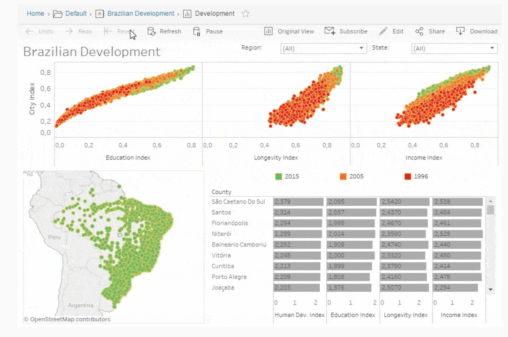
```
For more info: https://www.tableau.com/dashboard/what-is-dashboard

---
## Dashboards

```{r, echo = FALSE}
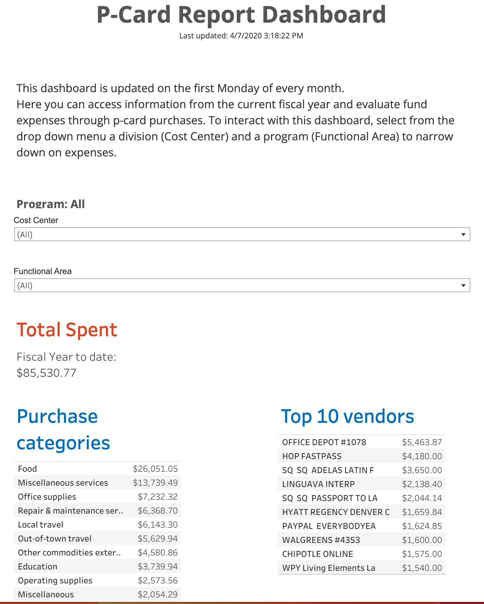
```

https://www.tableau.com/data-insights/dashboard-showcase/portland-office-community-civic-life-p-card-report-dashboard

---
## Getting to know Tableau:

* Bottom of screen: lower left is your data source
* Next to that are 'sheets' for your visualizations. 

```{r, echo = FALSE, out.width = "70%"}
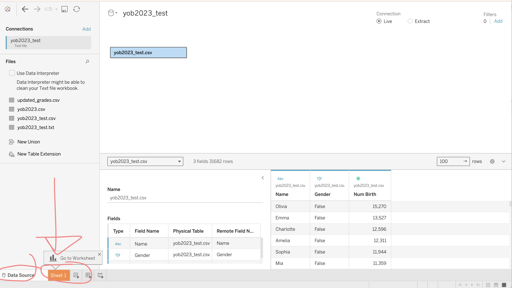
```

---
### Components in Tableau

* **Worksheet** A worksheet is a single view in a workbook. You can add shelves, cards, legends, visualizations, and more in a worksheet
* **Dashboard** A collection of multiple worksheets used to display multiple views simultaneously
* **Story** A story is a collection of multiple dashboards and/or sheets that describe a data story

Source: https://www.datacamp.com/cheat-sheet/tableau-cheat-sheet 

---
### Anatomy of a Tableau 
* **Sidebar**: panes for working with data
* **Data**: can set up data types
* **Canvas**: home for the viz you'll make

---
### Anatomy of Tableau: Sidebar

**Sidebar**: Panes for working with data
  * **Data**: The data pane on the left-hand side contains all of the fields in the currently selected data source;
  * **Analytics**: The analytics pane on the left-hand side lets you add useful insights like trend lines, error bars, and other useful summaries to visualizations

---
### Anatomy of a Tableau: Data 
**Data**: When working with data in Tableau, there are multiple definitions to be mindful of. 
  * **Fields**: Fields are all of the different columns or values in a data source or that are calculated in the workbook. They show up in the data pane and can either be dimension or measure field
  * **Dimensions**: A dimension is a type of field that contains qualitative values (e.g. locations, names, and departments). Dimensions dictate the amount of granularity in visualizations and help reveal nuanced details in the data
  * **Measures**: A measure is a type of field that contains quantitative values (e.g. revenue, costs, and market sizes). When dragged into a view, this data is aggregated, which is determined by the dimensions in the view
  * **Data types**: Every field has a data type which is determined by the type of information it contains. The available data types in Tableau include text, date values, date & time values, numerical values,boolean values, geographical values, and cluster groups

---
### Anatomy of Tableau: The Canvas
Where you create your data visualizations.

* **Tableau Canvas**: The canvas takes up most of the screen on Tableau and is where you can add visualizations

* **Rows and columns**: Rows and columns dictate how the data is displayed in the canvas. When dimensions are placed, they create headers for the rows or columns while measures add quantitative values 

* **Marks card**: The marks card allows users to add visual details such as color, size, labels, etc. to rows and columns. This is done by dragging fields from the data pane into the marks card 

---
class: center, middle, inverse
# Exercise: baby name data

---

## 2023 Baby name data

You can choose any year -- today's examples will cover 2023 and 1880. You can follow along or choose a different year!

Any babies with more than four births in a year will be included. 

```{r, echo = FALSE}
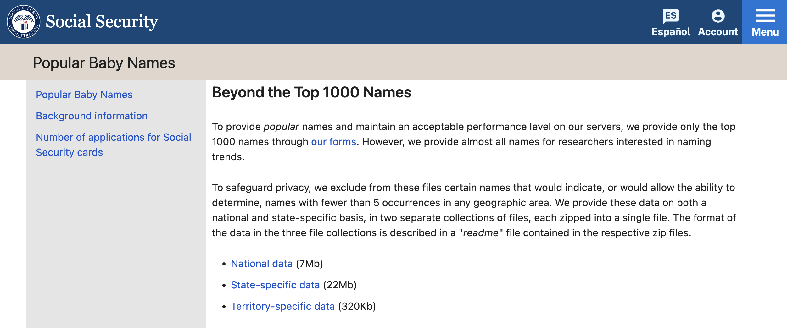
```

[Source](https://catalog.data.gov/dataset/baby-names-from-social-security-card-applications-national-data)

---
## Basic visual: 2023

Start from a rule of threes with a general focus on getting a handle on what is happening. Think about these questions and the best way to visualize!

1. **Overall stats**: breakdown by gender
2. **Top names** -- top N baby names
3. How much 'space' does the most **popular name** take up (e.g. proportion of all names)?


---
### Basic visual: 2023
.tiny[
Start from a rule of threes with a general focus on getting a handle on what is happening. Think about these questions and the best way to visualize!

1. **Overall stats**: breakdown by gender
2. **Top names** -- top N baby names
3. How much 'space' does the most **popular name** take up (e.g. proportion of all names)?

]


```{r, echo = FALSE}
include_graphics("images/Screenshot 2024-12-26 at 3.35.41 PM.png")
```

---
### Basic visual: 2023
.tiny[
Start from a rule of threes with a general focus on getting a handle on what is happening. Think about these questions and the best way to visualize!

1. **Overall stats**: breakdown by gender
2. **Top names** -- top N baby names
3. How much 'space' does the most **popular name** take up (e.g. proportion of all names)?

]


```{r, echo = FALSE}
include_graphics("images/Screenshot 2024-12-26 at 3.38.05 PM.png")
```


---

# Tableau: 2023 plots

```{r, echo = FALSE}
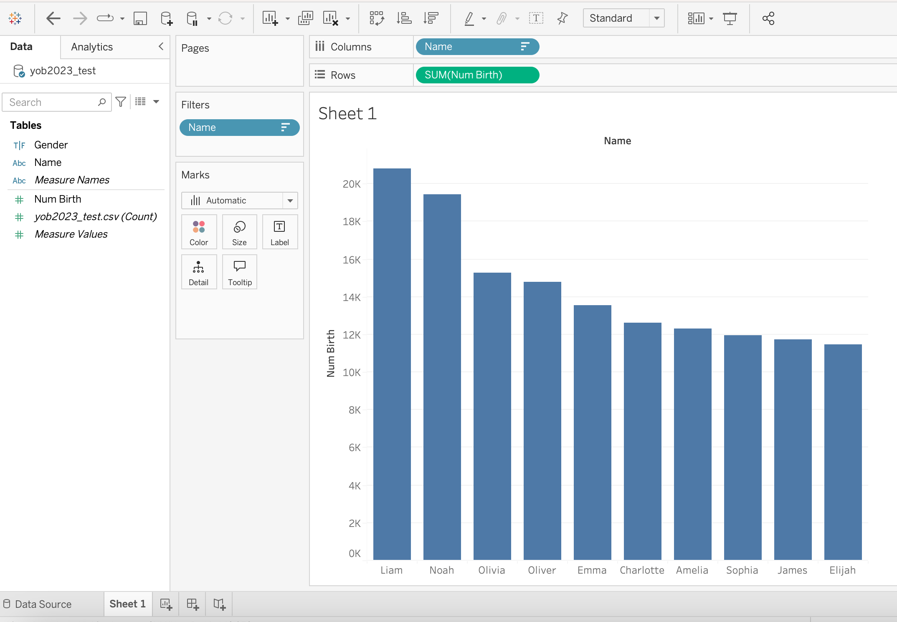
```


---
# Tableau: 2023 plots 
Change to percents

```{r, echo = FALSE}
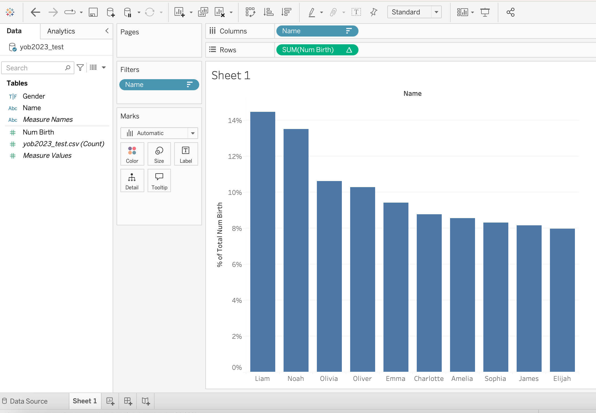
```

--
Now, replicate with 1880 (separately).


---
# MERGES ("Joins") vs "Relationships"

* Load both dataframes
* New union
* Match on name

> Relationships keep datasets separate while joins are bringing them together into one frame. 


---
# Tableau: Relationship


```{r, echo = FALSE}
include_graphics("images/Screenshot 2024-12-26 at 4.01.23 PM.png")
```

---
# Join our dataframes

* Match on name AND gender (why?)


```{r, echo = FALSE, out.width="72%"}
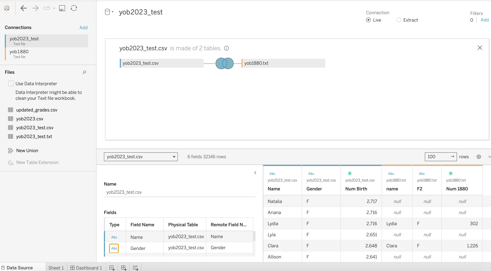
```

---

## Intermediate visuals: 2023 vs 1880
Adding a second year allows us to open up new possibilities using comparison (changes, what is new/old/constant, etc.)
--

* Consistency: names that were popular in both time periods?
* Names that were popular but aren't any more?
* Names that are 'new'?  
* Names moving from one gender to another? 


---


# Consistency: names that were popular in both time periods?
What criteria for our join? 

--
Names popular in BOTH (inner join!)

```{r, echo = FALSE}
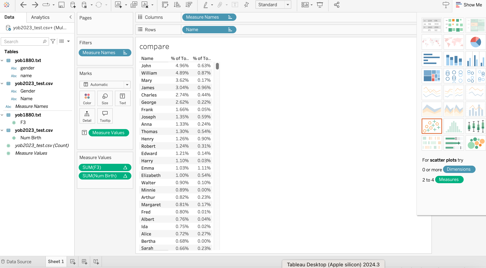
```

---
## Names that were popular but aren't any more?
.panelset[.panel-name[Old pop]
```{r, echo = FALSE}
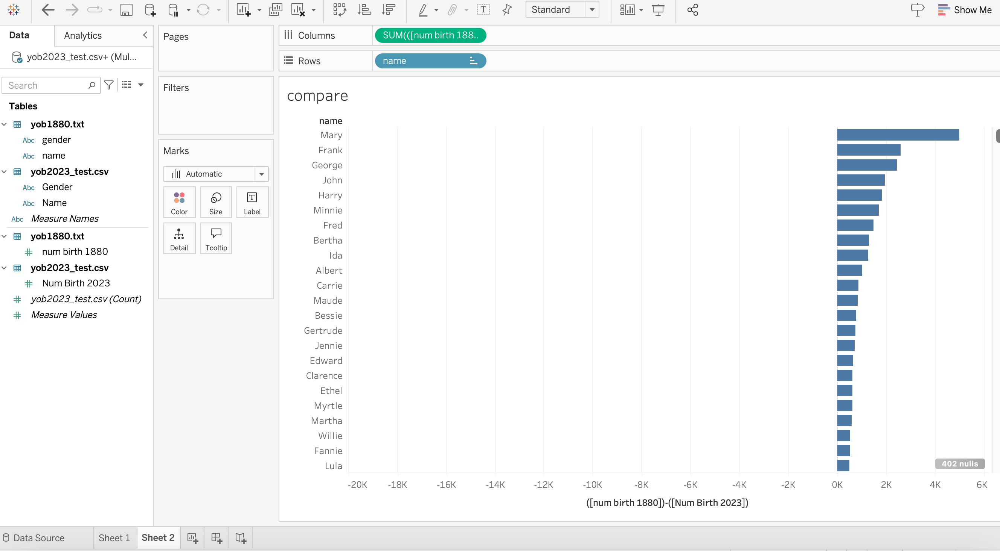
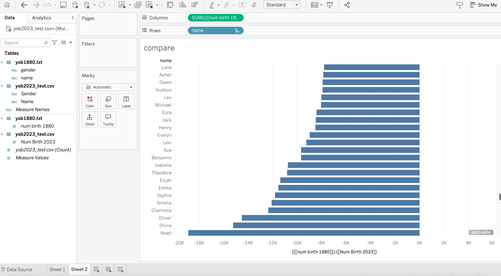
```
]
.panel-name[New pop][

]]

---
## Names that are 'new'? 

```{r, echo = FALSE}
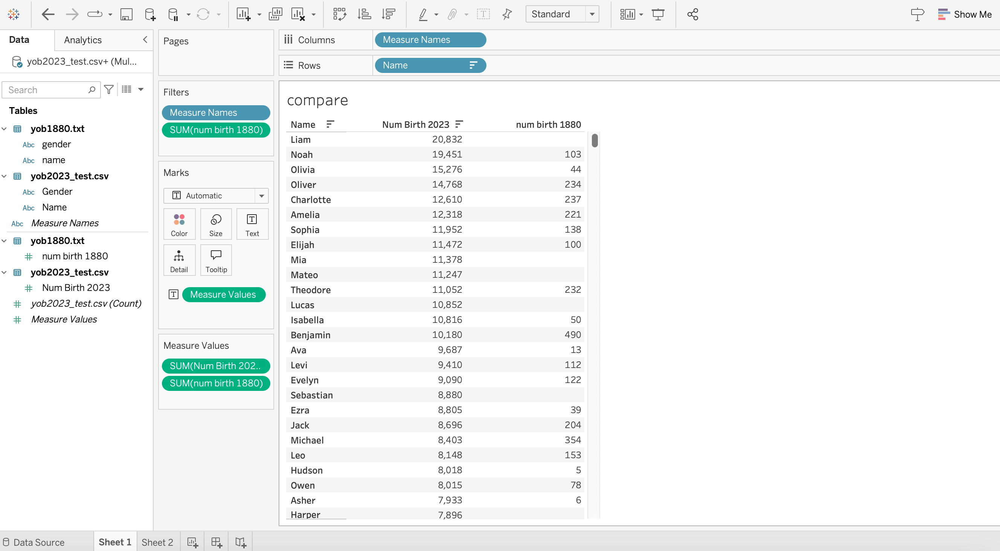
```

---
### Names moving from one gender to another? 
```{r, echo = FALSE}

```
---

# Dashboards
* Multiple graphics vs single
* Connection (think back to A2)
* Interactivity (meaningful, balanced)
* Use of tabs

https://help.tableau.com/current/pro/desktop/en-us/dashboards_best_practices.htm

---

# Making your dashboard

* Create tabs: one per graph
* Additional calculations if needed
* Sketch layout
  * top row for higher-level view
  * moving down, greater detail

---

# Formatting / fine-tuning 

* Consider color themes
* Focus on layout
* Eliminate redundancy
* Consider text (sparingly)

---

# Tableau Cloud vs Public

* Cloud: paid service, private

* Public: available to others (sharable)

https://public.tableau.com/app/profile/jean.clipperton/viz/macs40700/BabyNamesDashboard


---
# Dashboards vs Stories

* Dashboard is more traditional -- generally more visual-laden
* Story breaks into smaller pieces, breaking it into bite-size pieces

https://public.tableau.com/app/profile/tableau.docs.team/viz/EarthquakeTrendStory2/Finished-Earthquakestory


---
# ADVANCED 
.tiny[*Note: I haven't used this much yet, but could be very helpful*]

```{r, echo = FALSE, out.width="68%"}
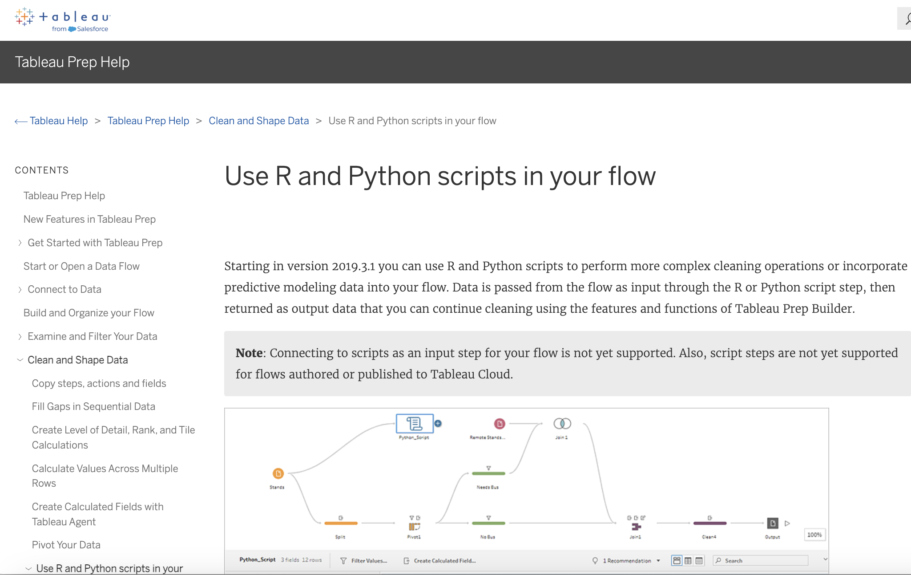
```

https://help.tableau.com/current/prep/en-us/prep_scripts.htm 

---
# Tableau: learning + takeaways

* Accessibility: public around
* Positions: many job postings ask for experience with Tableau (or Power BI, which is less intuitive IMO)

---
## Integrating Tableau into a workflow

* Use coding platform of choice to get data cleaned and sorted
* Can use as a standalone or integrate into workflow
  * For this session, we will only focus on Tableau Desktop (not connecting to servers)


---
# Think about how to provide overall summary

* What is your data source? 
* What is your question? 


---

# Maybe also option: Sketch (esquisse)

```{r, echo = FALSE}
include_url("https://cran.r-project.org/web/packages/esquisse/vignettes/get-started.html")
```


---
# Esquisse demo

```{r, eval = FALSE}
library(esquisse)
library(babynames) #up to 2017
esquisser(babynames)
```
---
# Recap

* Tableau can be a powerful tool
* Options to integrate with R or Python
* Design principles still apply
* Tableau-adjacent option esquisse in R

