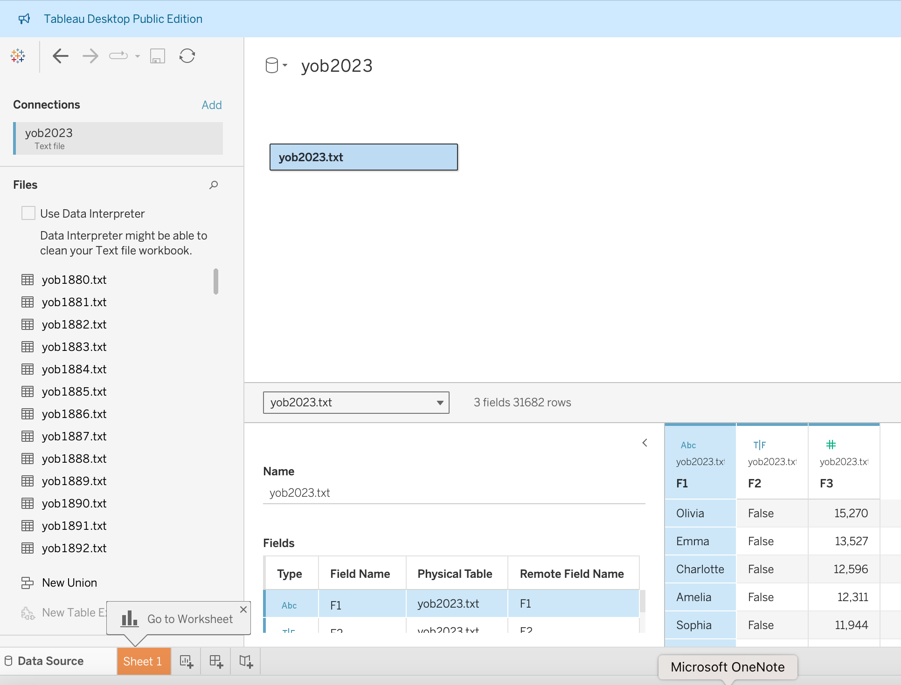
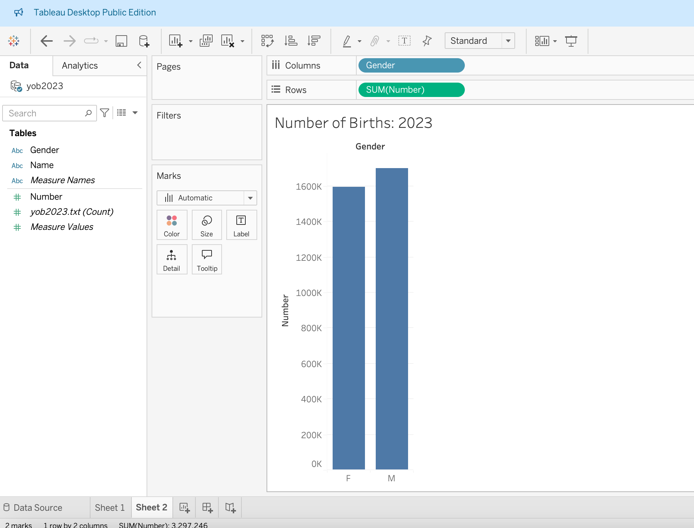
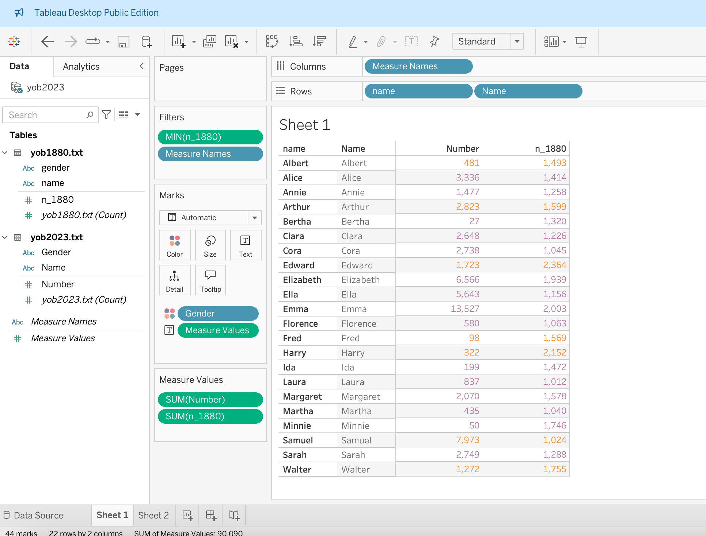
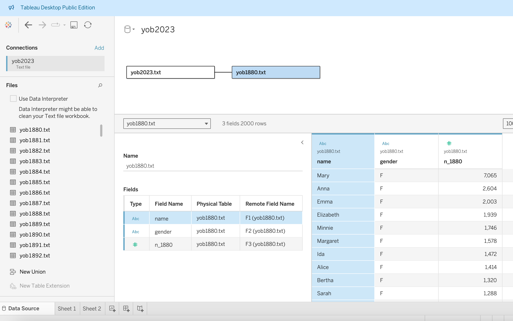

```{r setup, include = FALSE, cache = FALSE}
# generate CSS file
library(xaringanthemer)


# source in the default knitr options
source(here::here("R", "slide-opts.R"))

# enable panelsets and default theme
xaringanExtra::use_panelset()
# ggplot2::theme_set(ggplot2::theme_minimal(base_size = 16))

# load basic packages
library(knitr)
library(here)
library(tidyverse)
```

class: inverse, middle

# Announcements

---

## Announcements


---
# What is Tableau

* Public vs not
* Sharing and saving

---
## Starting a visualization

```{r}
library(c3s2)
write.table(c3s2::yob2023, file = "yob2023.txt") # pulling out the data we want to use!
# note: can export as other data types, too
```

--- 

# Tableau: downloads, etc.

Today assumes you've gone through the post on Ed and completed the download steps there:
* Sign into an existing Tableau.com account, or create a new account using your school-issued email
* Once signed in, visit the TFT Activation page to download the latest versions of Tableau Desktop and Tableau Prep Builder
* Activate with product key:    TC6P-A348-35B0-D0BF-5666       
  * Already have a copy of Tableau Desktop installed? Update the license key in the application: Help menu → Manage Product Keys


---
# Switch to Tableau
* Go to Tableau Desktop
* Load yob2023

---

class: middle, center, inverse

# Tableau: learning + takeaways
---
## Integrating Tableau into a workflow

* Use coding platform of choice to get data cleaned and sorted
* Can use as a standalone or integrate into workflow
  * For this session, we will only focus on Tableau Desktop (not connecting to servers)


---
## Getting started:

* Apply the same design principles we've come to know and love so far: 
  * think through the sketch
  * know your data
  * consider what you are trying to do


---
# Dashboards
Offers an opportunity to get a high-level view of your data. 

```{r, echo = FALSE}
include_url("https://www.tableau.com/dashboard/what-is-dashboard")
```

---
## Comparisons

```{r, echo = FALSE}
include_url("https://www.tableau.com/data-insights/dashboard-showcase/portland-office-community-civic-life-p-card-report-dashboard")
```


---
# Think about how to provide overall summary

* What is your data source? 
* What is your question? 

---
## Exercise: baby name data

You can choose any year -- today's examples will cover 2023 and 1880. You can follow along or choose a different year!

[Source](https://catalog.data.gov/dataset/baby-names-from-social-security-card-applications-national-data)

---
## Basic visual: 2023

Start from a rule of threes with a general focus on getting a handle on what is happening. Think about these questions and the best way to visualize!

1. Overall stats: how many babies are born and genders?
2. Top names -- overall and by gender
3. How much 'space' does the most popular name take up (e.g. proportion of all names)?


---
### Basic visual: 2023
.tiny[
Start from a rule of threes with a general focus on getting a handle on what is happening. Think about these questions and the best way to visualize!

1. Overall stats: how many babies are born and genders?
2. Top names -- overall and by gender
3. How much 'space' does the most popular name take up (e.g. proportion of all names)?

]


```{r, echo = FALSE}

```


---

# Tableau: 2023 plots


```{r, echo = FALSE}

```


---
# Tableau

--
Now, replicate with 1880 (separately).


---

## Intermediate visuals: 2023 vs 1880
Adding a second year allows us to open up new possibilities using comparison (changes, what is new/old/constant, etc.)

--

* Consistency: names that were popular in both time periods?
* Names that were popular but aren't any more?
* Names that are `new'? 
* Names moving from one gender to another? 

```{r, echo = FALSE}

```


--- 
# Tableau


```{r, echo = FALSE}

```


---
# ADVANCED 
*Note: I haven't done this yet, but could be very helpful*

```{r, echo = FALSE}
include_url("https://help.tableau.com/current/prep/en-us/prep_scripts.htm")
```


---
# Recap

* Tableau can be a powerful tool
* Options to integrate with R or Python
* Design principles still apply

